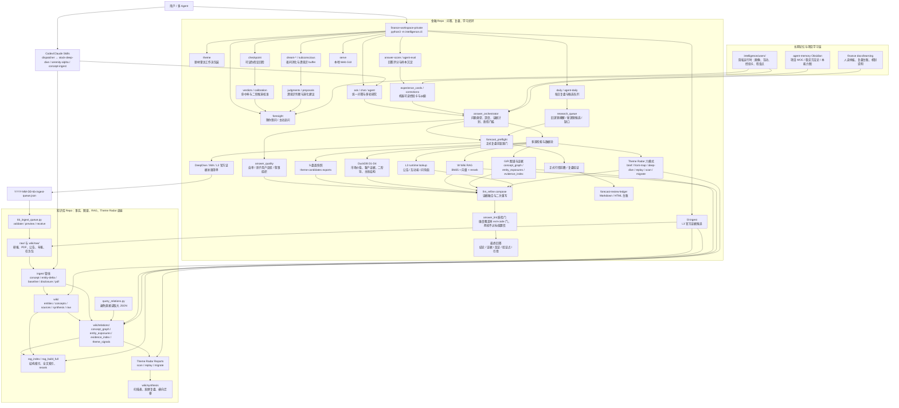
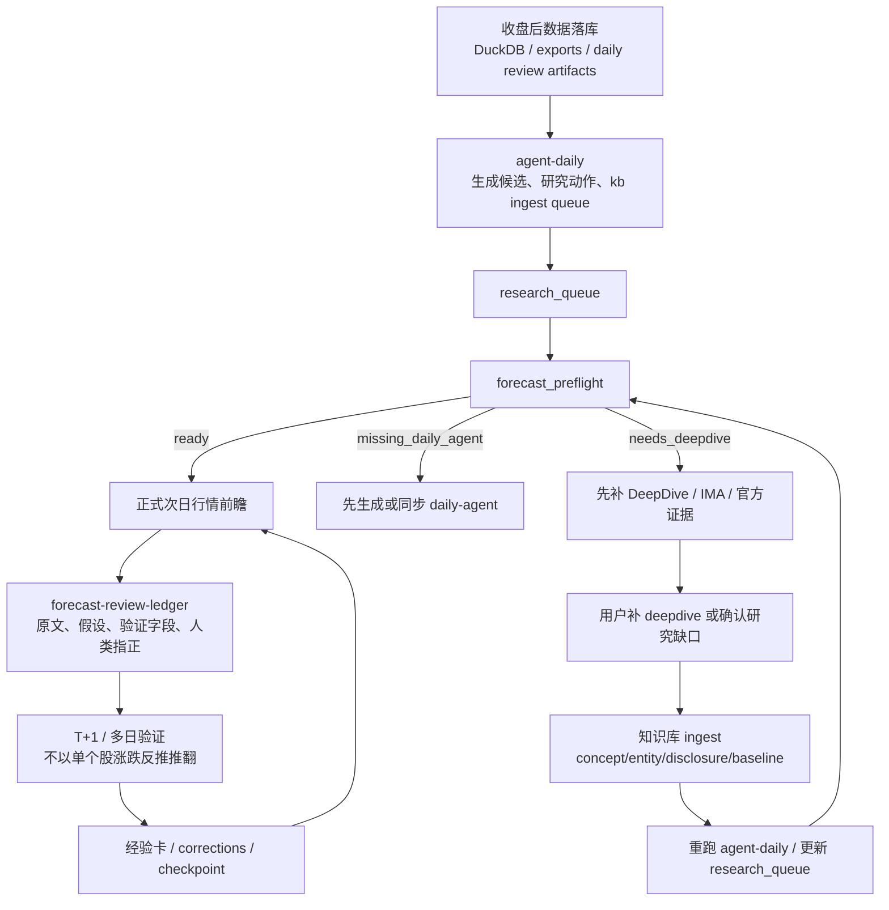
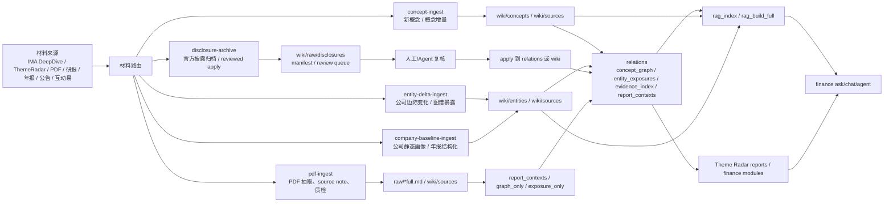

# 金融 Agent 能力图谱

这张图用于回答一个问题：**我的金融 Agent 现在有哪些节点、路径和回路？**

评接口深浅、找「人从哪走进来」不是本页：读仓内 `docs/agent-product-door.md`（产品门 / 两条引擎 / 积木）。本页是能力节点，不是产品门。

维护口径：
- 新增入口命令、服务模块、知识库 ingest 管线、运行时证据源、学习闭环或后台自动化时，都要回到本页追加节点。
- 单次问答纠偏不进本页；只有稳定能力、稳定流程或跨 repo 边界变化才更新。
- 主图只画“人能记住的能力节点”，细碎脚本放到节点清单或项目 MOC，避免图变成源码依赖图。
- **防漂移（硬门）**：节点清单表是机器可读事实源，「主要路径」列必须写成反引号 spec；每次改本页或相关仓有结构性合并后，跑 `python3 scripts/graph_audit.py`，exit 0 才算维护完成。spec 三种粒度：
  - `` `path` `` — 只校验路径存在。
  - `` `path::symbol` `` — 再校验符号真的在文件里（Python 走 AST，认定义名/引用名/整串相等的字符串字面量，注释里顺嘴一提不算）。**能力断言尽量写到符号一级**：文件名活得比符号久，只钉文件等于没钉。
  - `` `path::symbol@branch` `` — 在途能力，以声明分支为准，判 PENDING 不失败；符号进了默认工作树会打 MERGED 提醒提升为常规行。
- **exit 0 只对某个 revision 成立**：审计打印它审的是哪个 checkout 的哪个分支/sha/脏否。本地工作树常停在特性分支上，**别把「审计过了」读成「main 上是这样」**。

## 总览图

## 复盘前瞻闭环

## 知识库 ingest 与 RAG 闭环

## 节点清单

| 节点 | 所在仓库 | 主要路径 | 作用 |
|---|---|---|---|
| 方法验证实验 + 方法飞轮接线（已合 main，默认工作树未更新） | finance | `scripts/method_validation.py::cmd_history@gitea/main`、`scripts/method_validation.py::cmd_capture@gitea/main`、`scripts/method_validation.py::cmd_recheck@gitea/main`、`scripts/method_validation.py::cmd_daily@gitea/main`、`intelligence/services/method_validation/store.py::read_record@gitea/main`、`intelligence/services/method_validation/flywheel.py::derive_standing@gitea/main`、`intelligence/services/method_validation/flywheel.py::recall_for_query@gitea/main`、`intelligence/services/checkpoint_resolvers.py::MethodValidationResolver@gitea/main` | 固定方法协议→同日三组历史对照→当日冻结成员→后五日回检；同日幂等、实际时间门、不可覆盖摘要与旧档可读。07 接线：立场按收据派生（历史演练 / 真实前向分列、六类回检分类、采用 / 降低 / 排除梯子），有信号 D0 登记 checkpoint（`method_observation`）并由夜间 recheck 经 resolver 走原协议结算；`memory_lookup` / `[M]` 块 / 日报「方法信号与待验对象」段消费同一份摘要。全部 research_only、禁决策/晋升。基线 e41ef60b（R-20260908-05）；07 经 PR #692 合入 gitea/main `794cc3e5`（连带合入 method-validation-loop）；默认工作树更新后去掉 @gitea/main 提升为常规行。真实前向起点 2026-09-10，真实对话验收待网关恢复续跑。 |
| 同花顺官方数据源（在途） | finance | `market_feature_store/hithink_client.py@data-source/hithink-ingest`、`market_feature_store/sync/sync_hithink_stock_daily.py::sync_hithink_stock_daily@data-source/hithink-ingest`、`market_feature_store/sync/sync_hithink_sector_kline.py::sync_hithink_sector_kline@data-source/hithink-ingest`、`market_feature_store/sync/sync_hithink_limit_pools.py::sync_hithink_limit_pools@data-source/hithink-ingest`、`market_feature_store/sync/sync_hithink_dragon_auction.py::sync_hithink_dragon_auction@data-source/hithink-ingest`、`intelligence/services/teaching_framework/source_views.py::attach_teaching_sources@data-source/hithink-ingest` | 复盘会封号后的替代主源（持 key、≤5 QPS、不并发）：个股十年日 K + 复权事件、板块/指数三年日 K + 目录 + 当前成分、涨停池六年与跌停炸板一年、龙虎榜/热榜/竞价，共 10 张 `*_hithink` 表并跑，旧表不删。四步挂进 `daily-full`（缺 key skip）。授课框架读口经 5 个 TEMP VIEW 切过去，**深度短于日历的源按日回退**（龙虎裸切会让 416 天日历空 166 天）。`tf.new_high_1y_count` 与 `tf.sector_*` 换了定义不是换了源，别与旧序列比大小。提交 a89cb83d / 848571ea / 5fb33d46，pytest 8350 passed，未合 main；收据 `docs/verification/2026-09-08-hithink-{a,b,c,d,e}.md`。 |
| CLI 总入口 | finance | `intelligence/cli.py` | 聚合 ask、daily、theme、l3、foresight、checkpoint、dream 等命令 |
| 飞书 IM 入口（已退役） | finance | `intelligence/cli.py::cmd_feishu_bot`、`intelligence/chat/feishu_bot.py::run` | shim：stderr 说明后 exit 2，不连 WebSocket。问答走 ask / Workbench Episode |
| 问答入口 | finance | `intelligence/services/ask.py` | 多源检索、模块 fan-out、compose 入口 |
| 多轮对话 | finance | `intelligence/services/ask_chat.py` | 首轮检索后复用证据做追问 |
| 自主工具 Agent | finance | `intelligence/runtime/agent.py` | LLM 自主决定调用只读检索工具 |
| 问答编排器 | finance | `intelligence/services/answer_orchestrator.py` | 问题类型、深度、视角、证据计划、质检门槛 |
| 正式复盘查漏门 | finance | `intelligence/services/forecast_preflight.py` | daily-agent 缺口未补齐时暂停正式复盘 |
| 回答质量层 | finance | `intelligence/services/answer_quality.py` | 输出前自审、叙事组织、影子用户反驳 |
| LLM 融合层 | finance | `intelligence/services/llm_refine.py` | compose、二次反驳/重写、provider 兼容 |
| L3 运行时证据 | finance | `intelligence/services/l3_evidence.py` | 公告、互动易、问询函运行时补查 |
| L3 入库候选 | finance | `intelligence/services/l3_ingest.py` | 把官方证据解析成候选 payload 或 source note |
| daily-agent | finance | `intelligence/workflows/daily_agent.py` | 生成每日候选、research_queue、kb-ingest-queue |
| 复盘台账 | finance | `docs/learning/forecast-review-ledger/` | 保存假设原文、验证、人类指正 |
| 经验卡 | finance | `intelligence/services/experience_cards.py::load_cards` | 低分回答/纠偏压缩成下次提示规则；`promotion=promoted_to_code` 与 `invalidated` 一样跳过注入（已固化进管线，避免重复供给） |
| 可证伪点 | finance | `intelligence/services/checkpoints.py` | 登记、回检、校准历史判断。2026-09-06 起记录带 `object_type ∈ {judgment, agent_judgment, observation_script}`；存量记录只从确定的 `source` 反推，其余进 `unknown_legacy` 单独一格，**不折进 judgment**（一个默认值把三种来源合成一种，胜率面板就再也分不开） |
| 时间长河读取面 | finance | `intelligence/services/river.py` | as-of 六轨联立切片：`slice(as_of, knowledge_cutoff)` + 双时钟 + `pit_grade`（空切片 fail-closed 成 `trade_date_only`）+ 缺轨返回 `Gap` 不用别轨补。横扫纵扫**与区间聚合** `range_aggregate` 在 `river_query.py`、区间聚类在 `river_window.py`。区间聚合是「算区间涨幅」的正门：个股走 `close_to_close` 精确、板块只能连乘日涨幅（**无收盘点位**），返回值强制带 `coverage`（应有天数取自 `fact_market_daily`）与 `codes_seen`（跨供应商换源），全空列判成 `MetricGap` 不当 0，`require_complete=True` 时不给数只给 gap。**索引层不复制正文，只持 ref**。记录时刻 = `LEAST(updated_at, 快照台账 captured_at)`——`updated_at` 是刷新时间会被重发布推走，台账 `captured_at` 不动；**取较早不是换源**（整轨换源会让资金轨 47→20 天）。审计 `scripts/river_pit_audit.py` 从本模块导入同一份 SQL。实测联立可 strict 重放 1→16 天，存量 384 天是 legacy、记录时刻确实丢了不猜 |
| 观察剧本 | finance | `intelligence/services/observation_script.py` | 小白入口的可登记对象：变量 / 升级 / 降级放弃条件 + `late` 标记 + 状态机。确认即进既有 `checkpoints.jsonl`，到期走既有 recheck——**不另造回检引擎**。回检判「变量是否按条件触发」，不判涨跌（机检走 `market_daily` 不走 `stock_return`） |
| 合规硬门词表 | finance | `intelligence/services/compliance_gate.py` | 个股 / 方向词 / 时点 / 目标价 / 概率数字 / 「策略」单独出现 的**单一词表**，观察剧本硬门与 `validate_marketing_contracts.py` 共用；判官接入留 `scan(codes=...)` 口 |
| 带读模式 | finance | `intelligence/services/guided_reading.py` | 河切片 → 事实 / 限制 / 缺口 + 剧本骨架；**判读段故意留空**（授课框架母本由人写）。开关「新用户开、老用户关」，关闭时零读写。个股级对象按**对象形状**折叠成计数——带读是小白产品面，十条带涨幅的个股行就是一张名单 |
| 潜意识模式 | finance | `intelligence/services/subconscious.py` | 深挖纪要 buffer、判断提案、commit。2026-08-26 起捕获端由 dream-mine 夜间自动填充（见下），人工只管 review/commit |
| 夜间演化 | finance | `intelligence/dream/` | checkpoint recheck（launchd 已部署、活跃）；dream-collect/7A/7B/dream-nightly 为飞书时代产物，随 #413 标退役/按需——7B 职能由 daily-agent kb-ingest-queue 覆盖，7A 由 strategy-evolve skill 按需替代 |
| 对话挖掘 dream-mine | finance | `intelligence/dream/miner.py::run_mine` | 夜间从 Workbench 会话（纯文件只读）挖记忆提案：collector 增 workbench 源→已脱敏 store→LLM 只挖用户侧发言→提案进潜意识 buffer（session=dream-<date>）+ vault md；**suggest-only**，人工 `subconscious commit --apply` 才落台账。杀死条件预声明（连续 4 周零 commit 即退役），设计稿 `docs/superpowers/specs/2026-08-26-dream-loop-repoint-design.md` |
| 能力开关板 | finance | `intelligence/services/capability_switchboard.py::load_switchboard` | 组件机器可读登记表（capability/composer/verifier/prompt/predicate/parameter/operator/pack/probe 九类 + pointers 指「开关在别处」）+ default-v1 生成盒（从源码生成、字面量比对）；生产不读本表，消融 runner 专用。8796 sidecar 为其活体实例 |
| 知识库接收任务包 | knowledge | `scripts/kb_ingest_queue.py` | 接收金融 repo 的跨仓 JSON 队列 |
| 关系查询 | knowledge | `scripts/query_relations.py` | 安全查询 relations 大 JSON |
| RAG 检索 | knowledge | `scripts/rag_index.py`、`scripts/rag_build_full.py` | 结构索引、全文索引、BM25/向量/rerank |
| Theme Radar 报告 | knowledge | `skills/theme-radar-reports/` | scan、replay、migrate 三类报告 |
| 概念入库 | knowledge | `skills/concept-ingest/` | 新概念与概念增量 |
| 公司边际变化 | knowledge | `skills/entity-delta-ingest/` | 公司 delta、graph_only、exposure_only |
| 公司 baseline | knowledge | `skills/company-baseline-ingest/` | iFinD/年报等 L2 静态底座 |
| 官方披露归档 | knowledge | `skills/disclosure-archive/` | archive-only 到 reviewed apply |
| PDF 入库 | knowledge | `skills/pdf-ingest/` | PDF/OCR/raw/source note/质检 |
| 深挖/前瞻输出契约 | finance | `skills/stock-deep-dive/SKILL.md` | 个股深挖/复盘先验的当次必读输出契约（D1/D2/D3 + 十二视角） |
| 深挖/前瞻质检门 | finance | `skills/stock-deep-dive/scripts/answer_lint.py` | 最终稿维度覆盖率 exit-code 门 |
| 长期记忆 | agent-memory | `20_projects/`、`10_knowledge/` | 项目级交接与稳定方法论 |
| vault 质检门 | agent-memory | `scripts/vault_lint.py` | frontmatter/死链/type-目录一致性/inbox 老化 |
| 图谱防漂移审计 | agent-memory | `scripts/graph_audit.py` | 校验本页节点清单路径是否仍存在 |
| Agent 工具目录 | finance | `intelligence/services/research_tool_registry.py::_DEFAULT_TOOL_METADATA` | agent 可见工具的 catalog 与授权 spec 装配。**条目数用 AST 数，别抄任何写死的数字**（2026-08-06 实测 main 上 12 项） |
| Episode 工具面 | finance | `intelligence/services/episode_tools.py` | 组装 market/financial/mainline/l3/finance_query/evidence_search，按 `allowed_capabilities` 逐个 gate |
| 历史发现与条件比较（在途） | finance | `intelligence/services/historical_research/query.py::HistoryQuery@codex/feat-historical-discovery`、`intelligence/services/historical_research/episode.py::HistorySession@codex/feat-historical-discovery`、`intelligence/services/historical_research/methodology.py::prepare_methodology_candidate@codex/feat-historical-discovery` | Workbench 历史意图复用 finance_query 授权与既有 Episode：精确板块/个股日轴联立、版本化内置特征、相似召回、条件全集四格与缺失/未到期分组；RunStore 不可覆盖原件及同会话假设修订保留反例。方法桥接仅 private candidate 草稿，无自动登记/评价/认证；结果 research_only。代码5c980d79、1101项相关测试；真实验收仍有应用回退工具消息配对与合法case引用误拒，尚未完成端到端验收。接手见 `/Users/a77/fwp-wt-historical-discovery/docs/handoffs/inflight/codex-feat-historical-discovery.md`，未替换生产服务。 |
| Agent 检索工具 | finance | `intelligence/services/agent_research.py` | kb/web/news 默认工具 + `build_graph_tools` 的 graph_lookup/evidence_lookup |
| 技能桥 | finance | `intelligence/services/skill_tools.py` | 白名单 skill 调用；只读/无外呼红线下当前仅注册 serenity-alpha |
| 用户记忆读取 | finance | `intelligence/services/user_memory.py::memory_block_for_query` | planner 侧注入渲染好的 M 块。签名是 `(query, theme, entity, ...)`，底层 `_query_terms` 直接吃上游 LLM 已抽好的题材/实体——**动手补中文分词前先确认这两个可选参数是不是没传** |
| Agent 用户记忆工具 | finance | `intelligence/services/episode_tools.py::memory_lookup`、`intelligence/services/user_memory.py::relevant_memory_records` | agent 主动检索用户历史判断/纠偏；专属 `evidence_tier=user_memory`，不在 `_HARD_EVIDENCE_TIERS` 白名单内，故无法支撑硬确定性措辞。`produces` **有意留空**（词表里全是市场事实类 id，它只回历史先验），代价是它在 `check_satisfiability` 预检里永远不当 contributing_tool——属 fail-open 的漏抓，已由 `test_tool_produces_satisfiability.py` 三条用例钉住 |
| 跨轮研究项目先验（能力包 09，main@83e4185f · #689） | finance | `intelligence/services/research_project.py::prior_for_turn`、`intelligence/services/research_project.py::load_project`、`intelligence/services/followups.py::followup_kind` | 会话级研究状态的**只读投影**（run 链 / 消息 turn_intent·followups·citations / `checkpoints.jsonl`+`verdicts.jsonl` 裁决）；研究车道开工前渲染 ≤600 字先验块并入 `conversation_context`（进 `prompt_assembled`，不开新模型可见通道）；`GET /api/conversations/{id}/research-project` 出同一投影。追问卡带 `kind∈{gap_fill,alternative_explanation,condition_test,continue}`+`inherits`，点击随消息 POST `continuation` 落用户消息。降级轮不当「上轮结论」；裁决 miss/partial 把 condition_test 卡提前。不双写台账、不改 `run_store.py`。真模型验收 2026-09-09 因网关 429 只验到机制，研究差量未评；生产 8792 未切 |
| 三口径闭环检索（窄/宽/反） | finance | `intelligence/services/closed_loop_retrieval.py::retrieve_closed_loop`、`intelligence/services/counter_retrieval.py::plan_counter_targets` | W 源 KB 检索的 narrow/broad/counter 三趟 + 结论/线索/反方线索/丢弃四桶；反方按六风险桶构造反事实查询（KC-05），装配窗内保底 2 反方槽、无命中写「未检索到反方证据」。**「我们没有反方检索」是误判**（2026-08-25 险些重立案）；预算饿死 broad/counter 的坑已由 `_AttemptBudget.observe` 修掉 |
| 空袋替补观察探针 | finance | `intelligence/services/market_watch_pack.py::ProbeReceipt`、`intelligence/services/market_watch_pack.py::substitute_observation_receipts` | 主线题材无严格双红匹配时按预案补带「出清/分歧观察」标签的替补池（题材→成交额最大匹配板块→前2个股）。P0=盘面题四袋包内（#371 已合已切 8792）；P1-b=一般题 Engine A 开口预取消费 `market.substitute_observation` operator（已进默认树）。源自五臂 live-toolkit 医药替补决策 |
| 本地代码地图门面 | finance | `scripts/code_map.py::main` | 编码任务查询门面（status/query/build/ask）。正门压过结构图与本地叙事页；空图 fail-closed。已合 #274 |
| 产品门拓扑 | finance | `docs/agent-product-door.md` | 产品门 / 引擎 A·B / 积木。评接口时读此页，不要把注册表或数据块开关当成门。已合 #264 |
| 问题驱动补数（在途，能力包 08） | finance | `intelligence/services/tool_hunger.py::record_window_uncovered@feat/demand-driven-data-requests`、`intelligence/services/data_requests.py::build_requests@feat/demand-driven-data-requests`、`intelligence/services/data_requests.py::check_request@feat/demand-driven-data-requests`、`intelligence/services/data_requests.py::execute_resume@feat/demand-driven-data-requests` | 回答里的数据缺口 → 结构化补数请求 → 补齐完成信号 → 恢复原研究。接缝在生产装配的 `finance_query` runner：合法查询、请求窗落在库覆盖之外时留 `window_uncovered`（观测型）；`data-requests build/check/fill/resume` 合并请求、覆盖检查（交易日历 × 关键值非空 × 历史日不许被实时源覆写）、只在隔离库调现有 writer（拒绝生产库）、沿 Workbench 原会话重问且同 `data_version` 只一次。回执台账 `users/<user>/data_request_receipts.jsonl`；日产物 `{date}-data-requests.json` 与 kb-ingest-queue 同写入者。**请求不是台账，可由 tool_hunger 事件随时重建** |
| 排序与情景表达契约（在途，能力包 10） | finance | `intelligence/services/ranking_contract.py::parse_ranking_intent@feat/ranking-scenarios-10`、`intelligence/services/ranking_contract.py::apply_scenario@feat/ranking-scenarios-10`、`intelligence/services/ranking_contract.py::ingest_flip_conditions@feat/ranking-scenarios-10` | 多对象排序题（谁更值得优先研究 / 谁最受益 / 按预期差排序 / 如果…排序会怎么变）的表达层契约，沿 scenario_tree / track_contract 同一惯例：固定表头公司矩阵（优先级 1..N）+ 财务传导 + 竞争解释（≥2 + 区分变量）+ 改判条件表（↑/↓）+ 下一步；两条引擎都注入（`episode_protocol._question_type_rules`、`ask_synthesis`，`AskOptions.include_ranking_guidance`）。缺件以 `ranking_*` 合成 id 并入 `missing_outputs` 走既有 contract_rewrite 修复；`apply_scenario` 按改判条件表箭头机械再排序（不给权重/概率），再排序追问时把上一轮矩阵的机械基线注进 episode 指令，收据 `ranking_contract` 含 `rerank_consistent`；改判条件登记 `checkpoints.jsonl`（source=`ranking_flip_condition`），`foresight` 渲染。**「我们没有多公司排序/改判条件结构」在该分支合入前仍成立于 main**。冻结六题与真实验收见 `docs/superpowers/plans/2026-09-09-capability-upgrade/progress/10.md` |

## 更新规则

新增能力时按以下顺序补：

1. **先定位层级**：入口命令、服务模块、工作流、知识库 skill、数据源、学习闭环、后台自动化、长期记忆。
2. **主图只加稳定节点**：如果只是临时脚本，不进总览；如果会被 CLI、workflow、skill 或 daily-agent 长期调用，进图。
3. **同时补节点清单**：写清仓库、路径、作用。
4. **跨仓边界必须画边**：例如 finance 生成队列、knowledge 接收；finance 调 RAG、knowledge 提供索引。
5. **避免事实污染**：项目经验、问答打分和用户纠偏写项目学习层；公司/题材事实写知识库；项目级流程变化写 agent-memory。

## 变更记录

- 2026-09-09 · claude · 加一条**在途行**「排序与情景表达契约」（能力包 10，分支 `feat/ranking-scenarios-10`，提交 `444e520e`，未合 main）。此前多公司排序题落 theme_analysis / news_impact，契约只要判断 + 链条 + 反证，名单加形容词就能过门；现在有固定表头矩阵、改判条件表与机械再排序，改判条件进 checkpoints 供回检。基线首跑暴露两处运行环境问题（launcher 钉死的判官二进制已被清、共享网关整模型冷却 75 分钟），记在该单 `blocked/10.md`。合进默认树后去掉 `@branch`。
- 2026-09-09 · claude · 加一条**在途行**「问题驱动补数」（能力包 08，分支 `feat/demand-driven-data-requests`，未合 main）。此前 `finance_query` 窗口无数据只在 observation 里说一句、不留机器痕迹，补数无从起、补完无处回；现在 `tool_hunger` 多一类 `window_uncovered`，`services/data_requests` 聚合成请求、做覆盖检查、隔离补齐、回执恢复。反向验证在排练库上抓到真缺陷：`sync_akshare_sw_l1_daily` 历史窗把当日实时快照写到窗口末日（writer 缺 historical 模式，归 daily-full 维护者）。合进默认树后去掉 `@branch`。
- 2026-09-09 · claude · 加一条**在途行**「同花顺官方数据源」（工单 #41 A–E，分支 `data-source/hithink-ingest`，三个提交未合 main）。复盘会封号后 29 张表主源断了，这条是替代源：10 张 `*_hithink` 并跑表 + `daily-full` 四步 + 授课框架读口切换。**质检返工过一轮**：原实现把 `tf.dragon_*` 裸切到只回溯一年的新表，416 天日历空了 166 天（构建全绿、gap 账本里早写着这个数没人读）；改成按日回退后覆盖 408 天，比旧源单独的 405 天还多 3 天。可迁移原则与 exit-code 工具见 `10_knowledge/source-switch-coverage-must-be-reconciled-first.md` 与 `harness-reference/TOOLKIT.md` A 档。合并前需：前复权因子序列、软判据阈值重校、`daily-full` 真干跑。
- 2026-09-06 · claude · 加四条**在途行**（终局 spec `2026-09-06-personal-research-calibration-endstate-design.md` 的 V1）：时间长河读取面 ``（已实现六轨，09-05 的 gap roadmap 把它写成「缺口」，**已在 roadmap 顶部回写实施状态**，别照原文再做一遍）；观察剧本 / 合规硬门词表 / 带读模式 ``（本轮，tip `6594a872`，收据 `docs/verification/2026-09-06-observation-script-g03.md`）。可证伪点行补 `object_type` 三类对象。**两条分支都未合 main，合并顺序必须 river-slice-v0 先**；合进默认树后去掉 `@branch` 提升为常规行。
- 2026-08-28 · grok · 经验卡节点钉 `::load_cards`：`promotion=promoted_to_code` 与 `invalidated` 同 choke point 跳过注入。UMD 三臂实验证伪「数据库附带」——方法论已在编排/契约/质检门，再注入是重复供给。分支 `feat/promoted-to-code`。
- 2026-08-28 · claude · 7 条 MERGED 在途行按规则提升为常规行（audit 提示已具备）：dream-mine、能力开关板、counter_retrieval、替补探针两 spec（P1-b 已进默认树）、code_map 门面、产品门拓扑，均去掉 `@branch` 后缀。默认工作树 main@e4276e00 已追上这批合并。
- 2026-08-26 · claude · dream loop 重定向落地（#413 已合）：加「对话挖掘 dream-mine」行；「夜间演化」行改写为处置现状（7A/7B/dream-nightly 退役/按需，checkpoint recheck 独活）；「潜意识模式」行补捕获端来源。加「能力开关板」行（#350 已合、#415 扩容批 operator/pack/probe 登记 + pointers）。两行 spec 钉 `@gitea/main`：默认工作树 `feat/reading-rules-baseline-batch1` 刻意今晚不 pull（r3 交接：保持 08-26 夜跑单变量），追上后提升为常规行。8796 sidecar 已切 main tip 快照（原超集树 `76ee1e89` 退役保留可回退）。
- 2026-08-20 · grok · #264 已合 `gitea/main=db9569b9`。产品门拓扑 spec 从 `@refactor/ask-block-flags` 改钉 `@gitea/main`（远端特性分支已删；默认工作树仍是 `feat/reading-rules-baseline-batch1`，去掉 `@branch` 会 STALE）。追上默认树后再提升为常规行。
- 2026-08-20 · grok · 节点清单加「产品门拓扑」`docs/agent-product-door.md@refactor/ask-block-flags`：能力图谱回答「有哪些节点」；评接口 / 找入口走该页，避免把积木当成门。合进默认树后去掉 `@branch`。
- 2026-08-20 · grok · 飞书 IM（`feishu-bot`）入口退役：总览从「feishu-bot / serve」改成只留 `serve`；节点清单加退役行，钉 `cmd_feishu_bot` / `feishu_bot.run` 为 exit-2 shim。与飞书 Bitable 写入退役是两件事。
- 2026-08-20 · grok · #274 已合 `gitea/main=e0f6c1b7`。本地代码地图门面从 `@feat/code-map-facade` 改钉 `@gitea/main`（默认工作树仍是 `feat/reading-rules-baseline-batch1`，去掉 `@branch` 会 STALE）。追上默认树后再提升为常规行。
- 2026-08-20 · grok · 节点清单加「本地代码地图门面」：`scripts/code_map.py::main@feat/code-map-facade`。编码 agent 的 query/ask 正门，不进 intelligence.cli，不把 CRG 社区名当模块。当前金融仓工作树还在别的分支，写成在途行；合进默认树后再去掉 `@branch`。
- 2026-08-06 · claude · **`memory_lookup` 在途行按规则提升为常规行**：`fix/headless-tool-correlation-observability` 已合并 main（merge `52bbf2d6`）并删除分支，两个 `@branch` spec 去掉后缀，catalog 从 11 项变 12 项。**顺带记一个门禁的反向盲区**：上一条修的是「图谱说有、main 没有」发绿光；这次是「图谱说在途、main 已有」——`graph_audit.py` 把在途行标 `UNVERIFIED` 跳过，同样 exit 0。**两个方向都漏，说明 `@branch` 行需要一条到期检查**：分支已合并或已删除时应报红，而不是继续跳过。
- 2026-08-05 · claude · **修一次真实漂移 + 把门禁的断言粒度补齐**。漂移：`memory_lookup` / `relevant_memory_records` 两行写成 main 的现状，实际只存在于未合并分支 `fix/headless-tool-correlation-observability`（该分支 catalog 12 项，main 11 项）；已改写为 `@branch` 在途行。**门禁盲区（根因）**：旧 `graph_audit.py` 只校验路径存在，而 `episode_tools.py` 在 main 上确实在，所以漂移期间 exit 0 —— 门禁的断言粒度比它声称保护的东西粗一档。已加 `::symbol` / `@branch` 两级 spec 与 revision 自述（旧版从不说自己审的是哪个分支，读者默认按 main 读，而工作树长期停在特性分支）。
- 2026-07-02 · devin · 机制加固：Compose 后补 answer_lint 质检门节点；Skills 入口改为经 dispatcher 路由（修正 finance-stock-deep-dive → stock-deep-dive 命名漂移）；节点清单补 stock-deep-dive 契约/质检门与 vault_lint/graph_audit；新增「防漂移硬门」维护口径。
- 2026-07-02 · codex · 首版：基于 `finance-workspace-private` 与 `knowledge-base-private` 的 CLI、README、skills、docs 和近期 agent-memory 交接记录生成。
