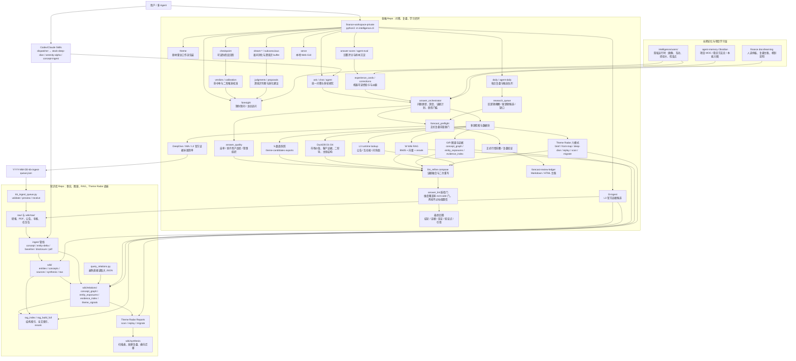
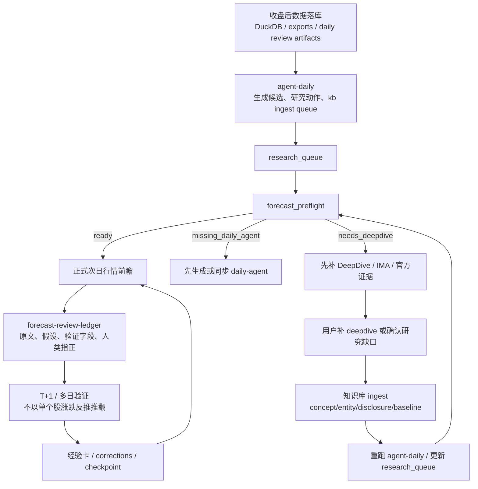
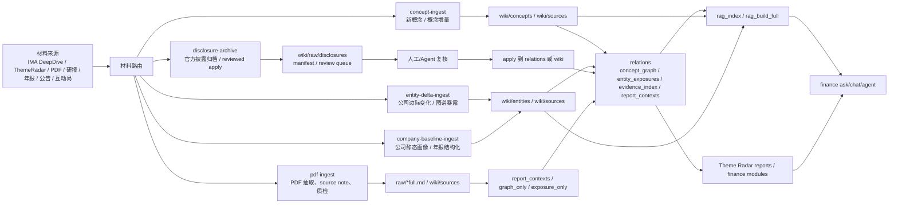

# 金融 Agent 能力图谱

这张图用于回答一个问题：**我的金融 Agent 现在有哪些节点、路径和回路？**

评接口深浅、找「人从哪走进来」不是本页：读仓内 `docs/agent-product-door.md`（产品门 / 两条引擎 / 积木）。本页是能力节点，不是产品门。

维护口径：
- 新增入口命令、服务模块、知识库 ingest 管线、运行时证据源、学习闭环或后台自动化时，都要回到本页追加节点。
- 单次问答纠偏不进本页；只有稳定能力、稳定流程或跨 repo 边界变化才更新。
- 主图只画“人能记住的能力节点”，细碎脚本放到节点清单或项目 MOC，避免图变成源码依赖图。
- **防漂移（硬门）**：节点清单表是机器可读事实源，「主要路径」列必须写成反引号 spec；每次改本页或相关仓有结构性合并后，跑 `python3 scripts/graph_audit.py`，exit 0 才算维护完成。spec 三种粒度：
  - `` `path` `` — 只校验路径存在。
  - `` `path::symbol` `` — 再校验符号真的在文件里（Python 走 AST，认定义名/引用名/整串相等的字符串字面量，注释里顺嘴一提不算）。**能力断言尽量写到符号一级**：文件名活得比符号久，只钉文件等于没钉。
  - `` `path::symbol@branch` `` — 在途能力，以声明分支为准，判 PENDING 不失败；符号进了默认工作树会打 MERGED 提醒提升为常规行。
- **exit 0 只对某个 revision 成立**：审计打印它审的是哪个 checkout 的哪个分支/sha/脏否。本地工作树常停在特性分支上，**别把「审计过了」读成「main 上是这样」**。

## 总览图

## 复盘前瞻闭环

## 知识库 ingest 与 RAG 闭环

## 节点清单

| 节点 | 所在仓库 | 主要路径 | 作用 |
|---|---|---|---|
| 机制表示合成诊断（未提交的实验量具，不属稳定产品能力） | finance | `intelligence/eval/mechanism_pilot.py::prepare@feat/mechanism-research-pilot`、`intelligence/eval/mechanism_pilot.py::run@feat/mechanism-research-pilot`、`intelligence/eval/mechanism_pilot.py::report@feat/mechanism-research-pilot` | R-20260916-04：相同材料/任务/预算，只变组织方式；量具代码在 `~/fwp-wt-mechanism-pilot` 尚未提交，故分支符号审计应标UNVERIFIED，不算已验证能力。作者合成6题、12格，协议已冻结；2026-09-16实际glm-5.3-flash/low完成12调用12答卷、0失败，下一证据两组6/6，反证集合逐条1/6机制2/6；均未漏gold反证，存在额外选择及无依据阈值，无机制优势或预测/投资效果结论（报告在该树docs/verification/2026-09-16-mechanism-pilot-live.md）。旁路、不接个人研究记忆，复用research_validation存储原语而非收益合同。另号R-20260916-05已从8792真实conversations入口完成2场（研究均partial），本地未提交采集器mechanism_workbench.py；路由与检索材料不同，仅作描述，无优势结论，发现拒绝跟踪仍在隔离测试用户写checkpoint，详见该树docs/verification/2026-09-16-mechanism-workbench-live.md。接手见该树 `docs/handoffs/inflight/feat-mechanism-research-pilot.md`；提交后重新审计再改变能力状态。 |
| 方法验证实验 + 方法飞轮接线（已合 main，默认工作树未更新） | finance | `scripts/method_validation.py::cmd_history@gitea/main`、`scripts/method_validation.py::cmd_capture@gitea/main`、`scripts/method_validation.py::cmd_recheck@gitea/main`、`scripts/method_validation.py::cmd_daily@gitea/main`、`intelligence/services/method_validation/store.py::read_record@gitea/main`、`intelligence/services/method_validation/flywheel.py::derive_standing@gitea/main`、`intelligence/services/method_validation/flywheel.py::recall_for_query@gitea/main`、`intelligence/services/checkpoint_resolvers.py::MethodValidationResolver@gitea/main` | 固定方法协议→同日三组历史对照→当日冻结成员→后五日回检；同日幂等、实际时间门、不可覆盖摘要与旧档可读。07 接线：立场按收据派生（历史演练 / 真实前向分列、六类回检分类、采用 / 降低 / 排除梯子），有信号 D0 登记 checkpoint（`method_observation`）并由夜间 recheck 经 resolver 走原协议结算；`memory_lookup` / `[M]` 块 / 日报「方法信号与待验对象」段消费同一份摘要。全部 research_only、禁决策/晋升。基线 e41ef60b（R-20260908-05）；07 经 PR #692 合入 gitea/main `794cc3e5`（连带合入 method-validation-loop）；默认工作树更新后去掉 @gitea/main 提升为常规行。真实前向起点 2026-09-10；日步 hook 已接不代表每日成功，更不代表方法有效。生产运行与历史验收边界见 [[2026-09-15-foresight-six-maps-production-audit]]。 |
| 同花顺官方数据源（同步器已合，分步接线/只读验算在途） | finance | `market_feature_store/hithink_client.py@gitea/main`、`market_feature_store/sync/sync_hithink_stock_daily.py::sync_hithink_stock_daily@gitea/main`、`market_feature_store/sync/sync_hithink_sector_kline.py::sync_hithink_sector_kline@gitea/main`、`market_feature_store/sync/sync_hithink_limit_pools.py::sync_hithink_limit_pools@gitea/main`、`market_feature_store/sync/sync_hithink_dragon_auction.py::sync_hithink_dragon_auction@gitea/main`、`intelligence/services/teaching_framework/source_views.py::attach_teaching_sources@gitea/main`、`skills/daily-full-review/scripts/run_review_sync.py::sync_hithink_step@fix/hithink-review-wiring`、`market_feature_store/sync/sync_hithink_sector_kline.py::_flush_constituents@fix/hithink-review-wiring`、`market_feature_store/hithink_sector_preview.py::preview_sector_calculation@fix/hithink-review-wiring`、`market_feature_store/cli.py::cmd_hithink_sector_preview@fix/hithink-review-wiring`、`market_feature_store/hithink_sector_capture.py::SectorCapture@fix/hithink-review-wiring`、`market_feature_store/hithink_sector_capture.py::audit_capture@fix/hithink-review-wiring`、`market_feature_store/hithink_sector_capture.py::capture_inputs@fix/hithink-review-wiring`、`market_feature_store/hithink_stock_preview.py::preview_stock_calculation@fix/hithink-review-wiring`、`market_feature_store/cli.py::cmd_hithink_stock_preview@fix/hithink-review-wiring` | 独立并跑表：个股K/复权、板块K/目录/当前成员、涨跌停炸板池、龙虎榜热榜竞价。9621128a接local分步：日期下传、缺key可见skip、失败原位恢复且未恢复阻断。dcee18f2修真实上海采集时间/整批事务替换；预览显式等权或指数、同名单两日额、缺口不缩池。c85d0101新增目录/成员逻辑请求版本：IO前持久化计划、终态写者不可覆盖、白名单原件/行与清单指纹核对、指定capture_id只读消费已验证行不回退。40317d78加个股标准化只读预演（合同hithink-stock-preview-v1）：显式股票分母＋相邻计划交易日，仅普通行情/纯现金除息、Decimal完整上下文固定半进舍入，元/股换算亿元/手，名称/换手率NULL、非现金/缺前日/零成交报缺口不猜，exit0只表示声明范围可算。请求完成度分范围，provider_completeness=unverified、production_ready=false；不是K线覆盖/供应商全集/冻结行情证明。作者干净全量、六类变异后恢复、前端及三视口E2E已验（本机Node26，非CI Node22/Linux同环境）；单仓registry通过、跨仓KB指纹仍红；前三片独立QC因额度/服务不可用未完成（以上全量/变异/E2E只属c85d0101）；个股预演片40317d78同日补齐：全量9834P干净（2ad19f35代码等同）、12项删保护变异全红、前端四叶绿（非E2E）、registry finance侧零漂移（kb侧7处既存红）、独立QC（k3隔离树，本任务首份报告）无P0/P1/P2、155探针全过，仅两条P3（CLI失败路径缺contract_version、文档缺2026年份边界）未修。local仍skip-constituents、不投影canonical，未验真实字段/日报恢复，未部署。允许同花顺池不等于换算法，公式/单位/复权/窗口仍另验。版本收据见docs/handoffs/2026-09-15-hithink-sector-capture-audit.md，个股预演快照docs/handoffs/2026-09-15-hithink-stock-preview.md，接手见docs/handoffs/inflight/fix-hithink-review-wiring.md；09-08接源历史证据不代签本轮。 |
| 计算与产物：财务观察值 + 沙箱结果协议 + 可下载计算件（已合 main；效果边界见审计） | finance | `intelligence/services/market_financials.py::observations_by_line@gitea/main`、`intelligence/services/episode_tools.py::attach_financial_observations@gitea/main`、`intelligence/services/sandbox_fincalc.py::to_single_quarter@gitea/main`、`intelligence/services/derived_calculation_artifacts.py::publish_calculation_artifacts@gitea/main`、`intelligence/services/derived_calculation.py::load_calculation_record@gitea/main` | 能力包 04（沙箱底座与产物链均已进入本次核定 main/生产；不是等待 #682 代码合入）：`financial_data` 每数据行挂带口径单位的结构化观察值（`revenue_cum_yi` 等）并支持 `subjects` 一次取多家；沙箱 prelude v2 给脚本 `PARAMS` / `fincalc`（累计→单季、同比环比、情景表、敏感性网格，零分母/缺季/坏单位回 None 不填 0）/ `emit_result` 结果协议；`params` 进 calc_id、`inputs_from_calc` 沿用上一轮输入快照（不重取数、哈希链不断）；计算记录经 `telemetry` 在 run 收口时渲染成 `calc-<id>.json/.csv/.html` 可下载产物。确定性干跑（真实东财数据、不调模型）茅台六个单季营收与独立参照 6/6 一致。隔离真模型曾生成可下载计算产物；完整真模型题集与稳定使用效果仍未证明。见 `docs/superpowers/plans/2026-09-09-capability-upgrade/progress/04.md`。 |
| 研究进化：判断维护 / 研究排序 / 方法验证 / 流程诊断 / 使用测量 + Workbench 接线（已合 main，PR #750 → `6e23dd57`，2026-09-16；默认工作树未更新故仍钉 `@gitea/main`） | finance | `intelligence/services/judgment_maintenance/assess.py::assess@gitea/main`、`intelligence/services/research_priority/ranker.py::prioritize@gitea/main`、`intelligence/services/research_validation/service.py::freeze_study@gitea/main`、`intelligence/services/research_diagnostics/report.py::diagnose@gitea/main`、`intelligence/services/product_value/measure.py::measure_pair@gitea/main`、`intelligence/services/research_evolution/facade.py::ResearchEvolutionService@gitea/main`、`intelligence/services/research_evolution/store.py::EvolutionStore@gitea/main`、`intelligence/api/research_evolution.py::build_router@gitea/main` | 研究进化批次（spec `docs/superpowers/specs/2026-09-13-research-evolution/`，在 `docs/river-next-specs`）：沿**已绑定证据**维护旧判断（哈希变 = 需复核，不是已证伪；三值条件）、按可改变判断的证据与研究时间排序、冻结对照 + 前向登记的方法验证、有证据的流程诊断与一题练习、产品使用测量。06 把它们接进既有 Workbench 会话：`GET /api/conversations/{id}/research-evolution` 加三个 POST，判定全部回调 01–05 真函数，06 只取数与授权；新台账单 writer 落 `user_space(user).root/research_evolution/`，已在 `docs/learning/ledger-map.md` 登记。`?user=` 不是认证——未配认证层时只认服务配置用户与 `RESEARCH_EVOLUTION_ALLOWED_USERS` 白名单。**真实前向样本与真人试点均未开始**：03 一律 pending，05 `commercial_status=unstarted`，不得据此宣称方法有效或有商业验证。组合分支 `feat/research-evolution-06-workbench`，未合 main；合进默认树后去掉 `@branch`。另有 `fix/re06-visibility-timing@a4ace074`：`intelligence/webapp/src/components/ResearchActivityControl.tsx::ResearchActivityControl@fix/re06-visibility-timing` + `intelligence/webapp/src/researchActivity.ts::startResearchActivity@fix/re06-visibility-timing` 接通显式同意的会话可见/隐藏计时，停止/切会话/pagehide尽力保存末段与撤回；`task_id=null`、仅workbench自用，不冒充冻结配对分配。三视口合成可见性→真API台账已验；I14任务身份/模型等待/完成到不可变测量收据尚未闭环，独立QC未完成，不是试点效果或生产部署。。**I11 同意门（2026-09-16，`intelligence/services/research_evolution/run_observer.py::ObservingRunStore._measurement_consented@gitea/main`）**：owner 表达过同意范围后须 `research`+`logging` 同时生效才写自用测量事件（`run_started/run_finished/cost_recorded`），撤回后研究照跑测量停；无记录保持自用默认照写；第九轮独立复核 20 探针放行（`docs/verification/re06-50074c76/REVIEW.md`）。遗留：I14 计时接线（`fix/re06-visibility-timing` 待 rebase）、F2 前端同意控制未交付、写读折叠函数两份 |
| CLI 总入口 | finance | `intelligence/cli.py` | 聚合 ask、daily、theme、l3、foresight、checkpoint、dream 等命令 |
| 飞书 IM 入口（已退役） | finance | `intelligence/cli.py::build_parser@gitea/main`、`intelligence/chat/README.md` | 本次核定 main/生产的 CLI 已不注册 feishu-bot，原 cmd_feishu_bot 与 chat/feishu_bot.py 已移除；非法子命令由 argparse 拒绝，不再描述成仍存活的退役 shim。产品门页该处文字仍旧，问答走 ask / Workbench Episode。 |
| 问答入口 | finance | `intelligence/services/ask.py` | 多源检索、模块 fan-out、compose 入口 |
| 多轮对话 | finance | `intelligence/services/ask_chat.py` | 首轮检索后复用证据做追问 |
| 自主工具 Agent | finance | `intelligence/runtime/agent.py` | LLM 自主决定调用只读检索工具 |
| 问答编排器 | finance | `intelligence/services/answer_orchestrator.py` | 问题类型、深度、视角、证据计划、质检门槛 |
| 正式复盘查漏门 | finance | `intelligence/services/forecast_preflight.py` | daily-agent 缺口未补齐时暂停正式复盘 |
| 回答质量层 | finance | `intelligence/services/answer_quality.py` | 输出前自审、叙事组织、影子用户反驳 |
| 数字条件门引用隔离（在途组合候选） | finance | `intelligence/services/episode_protocol.py::strip_evidence_ordinals@fix/8792-boundary-integration` | 原修复`2841ce66`已组合进`3faf64fb`：答案与证据数量提取共用协议引用语法，E27不充当阈值或数值依据；原文、未知引用与真实阈值保护保留。冻结8792样本第20句误报移除，24/25仍拒绝；与日期门组合的双模式测试及固定提交四叶已验，不代签语义正确性。09-18固定3faf真实会话保留2026-10-21+E45/E43计划，真证据离线6门对照通过；四题含1运行失败，整体验收未过。未push/合main/部署；看 `docs/handoffs/inflight/fix-8792-boundary-integration.md`，不借旧枝收据。 |
| LLM 融合层 | finance | `intelligence/services/llm_refine.py` | compose、二次反驳/重写、provider 兼容 |
| L3 运行时证据 | finance | `intelligence/services/l3_evidence.py` | 公告、互动易、问询函运行时补查 |
| A股研究数据链（在途候选，整体交付未过） | finance | `intelligence/services/market_capital.py::capital_bundle_for_llm@feat/research-data-readiness`、`intelligence/services/episode_tools.py::capital_data_runner@feat/research-data-readiness`、`intelligence/services/provider_observability.py::provider_gap_messages@feat/research-data-readiness`、`intelligence/services/derived_calculation_artifacts.py::result_contract_errors@feat/research-data-readiness`、`intelligence/services/episode_semantic_verifier.py::_recheck_research_delivery@feat/research-data-readiness` | a31b572f接d773：旧ask/Episode共用两融/大宗/解禁；空/错/未尝试与历史披露边界分开，授权/材料/外呼门不放宽。财报同批真行与主体/指标/单位/报告期送达，可比候选限唯一细分行业和同日。新计算成功前验结果格式；有限检查拦查询空错推出无公告、按显式报告期/比率列核抄数，错格留缺口、不静默改数。原预算同会话续修带具体错因，局部保原绑定且仍引用的证据，最终公开投影再验。固定工程11635P/83S/2x、前端107P/E2E34P2S、registry通过；13组新撤保护断言红→绿，原默认35组仅作兼容复跑；冻结输入真实沙箱/展示与独立Decimal一致并验输入扰动。不是通用语义/公式/任意脚本消费认证；脚本SDK37例、注入判官和原件重放不代签自然模型。零新live，旧公告/计算/历史题失败不翻案，来源未恢复。未push/合main/部署，8907已停/8792未动；本枝docs/handoffs/2026-09-18-research-delivery-guards.md，旧数据收据仍见research-data-readiness快照。 |
| L3 入库候选 | finance | `intelligence/services/l3_ingest.py` | 把官方证据解析成候选 payload 或 source note |
| daily-agent | finance | `intelligence/workflows/daily_agent.py` | 生成每日候选、research_queue、kb-ingest-queue |
| local 夜跑受控恢复（源码在途，部分修复已生效） | finance | `scripts/recover_local_review.py::main@fix/nightly-review-0917`、`scripts/recover_local_review.py::recovery_stitch_command@fix/nightly-review-0917`、`skills/duckdb-backfill/scripts/backfill_stock_daily_sina.py::cmd_fetch@fix/nightly-review-0917`、`tests/test_index_local_fallback_boundary.py::test_local_refuses_fallback_without_network@fix/nightly-review-0917` | 5204bb32：日期化历史/快照输入、IPO发行价与CDR专用来源、断点续抓；复用staging+run_id+换库前备份，补底行情后显式重建已完成板块并按日派生。09-16/17生产数据/跨日/报告/L2门及最终快照09-17已验，114项定向和删刷新分支变异1F；不是全链输入指纹失效机制，未跑本枝全量/独立QC。装机与生效plan已恢复local，真实同步树只覆盖指数禁止复盘会fallback模块；恢复脚本未变成第二条定时写链，源码未合。恢复时的387028b8固定根只是一次性调用；后续正式装机与真实launchd验收见下方生成接线条目，不混认两轮证据。方法capture仍被旧v3协议拒绝。详见本枝docs/handoffs/2026-09-17-local-review-recovery.md。 |
| 日报计划契约对齐（在途） | finance | `market_feature_store/consumption_registry.py::resolve_plan@fix/local-plan-gate-alignment`、`intelligence/workflows/daily_review.py::DailyReviewOptions@fix/local-plan-gate-alignment`、`market_feature_store/quality.py::check_daily@fix/local-plan-gate-alignment` | 显式参数 > REVIEW_SYNC_PLAN > full；auto 按目标交易日解析，两道门及 HTML 内部门显式传实际计划；local 仍豁免题材资金面板，不改口径。旧 daily-update 不支持 local/cheap，实际选中时拒绝而非偷跑 full。代码 4fbc8c42，针对性144P，删传参变异9F；/tmp 全量9654P/2F保留，原因是minimal允许读/tmp，非网络隔离失效；/Users下07d42891全量9656P/0F。源码未合；其前置计划契约随387028b8生成快照于09-17部署，范围及未验边界见下一行。 |
| 日报生成双根接线（已装机，源码未合） | finance | `scripts/run_daily_generation.py::main@fix/generation-root-boundary-guards`、`intelligence/workflows/generation_paths.py::validate_generation_paths@fix/generation-root-boundary-guards`、`intelligence/cli.py::daily_options_from_args@fix/generation-root-boundary-guards`、`tests/test_eval_launchd_wiring.py::test_generation_override_is_scoped_to_its_child@fix/nightly-generation-deploy-0917` | #50：387028b8修最终后代/文件软链、同一次CLI解析及import前代码归属；静态预检不是OS沙箱。09-17用户授权后，2fa28a4f只为生成子进程设置FINANCE_GENERATION_CODE_ROOT对应代码根，L2/外层质检/方法仍d433b90788c0，数据/users/episode不迁移。新冻结runtime生成47P、原探针未改判据独立复跑7/7，wrapper87P及删子进程赋值变异被抓；不是独立模型QC或本枝四叶。23:44:01–23:45:44真实launchd kickstart退出0，生成19步PASS，local同日/跨日/L2/报告门通过；L2已有complete故本轮非重新实扫；KB9任务只received。快照仍前次22:03恢复发布、served09-17，readiness一致。方法capture仍因旧协议拒绝。未合源码、未验下一次20:40定时触发、真实Workbench模型episode；不借旧作者9704P/前端76P/E2E15P/registry收据冒充合流准入。正文fix/nightly-generation-deploy-0917的docs/handoffs/2026-09-17-nightly-generation-deployment.md；不可变收据~/.finance-runtime/generation-deploy-20260917/。 |
| 复盘台账 | finance | `docs/learning/forecast-review-ledger/` | 保存假设原文、验证、人类指正 |
| 经验卡 | finance | `intelligence/services/experience_cards.py::load_cards` | 低分回答/纠偏压缩成下次提示规则；`promotion=promoted_to_code` 与 `invalidated` 一样跳过注入（已固化进管线，避免重复供给） |
| 可证伪点 | finance | `intelligence/services/checkpoints.py` | 登记、回检、校准历史判断。2026-09-06 起记录带 `object_type ∈ {judgment, agent_judgment, observation_script}`；存量记录只从确定的 `source` 反推，其余进 `unknown_legacy` 单独一格，**不折进 judgment**（一个默认值把三种来源合成一种，胜率面板就再也分不开） |
| 时间长河读取面 | finance | `intelligence/services/river.py` | as-of 六轨联立切片：`slice(as_of, knowledge_cutoff)` + 双时钟 + `pit_grade`（空切片 fail-closed 成 `trade_date_only`）+ 缺轨返回 `Gap` 不用别轨补。横扫纵扫**与区间聚合** `range_aggregate` 在 `river_query.py`、区间聚类在 `river_window.py`。区间聚合是「算区间涨幅」的正门：个股走 `close_to_close` 精确、板块只能连乘日涨幅（**无收盘点位**），返回值强制带 `coverage`（应有天数取自 `fact_market_daily`）与 `codes_seen`（跨供应商换源），全空列判成 `MetricGap` 不当 0，`require_complete=True` 时不给数只给 gap。**索引层不复制正文，只持 ref**。以下记录时刻与选版说明核自 `gitea/main@1fef3d276d0e`：**当前库直读的板块系行**由 `sector_recorded_at_sql` 返回 `CAST(v.updated_at AS TIMESTAMP)`；在内容更新同时推进 `updated_at` 的写入合同下，该上界只变晚、不变早，`updated_at <= C` 足以证明当前内容在 C 时已知，`> C` 不能证明当时不存在，非 strict 路径降档、`require_strict` 路径滤成 `Gap(pit_filtered)`。其他轨按各自 provider 取记录时刻，例如舆论轨用 `created_at`，不泛化为六轨全用 `updated_at`。**`LEAST(updated_at, 名单快照 captured_at)` 已于 `07857c80`（#43 / OPT-01）撤销**：名单时刻不证明行情内容，T 日 1% 被 T+7 修订为 9% 时会让 9% 冒充 T 日 strict。取回旧值走 **#47 内容版本取回**（`docs/superpowers/specs/2026-09-11-river-frozen-content-versions-workorder.md`）：`slice_river(..., frozen_snapshot_root=...)` + `river_frozen.connect_frozen` 已在该 main，显式启用后从截止前可用的封印快照读取；覆盖表见 `SNAPSHOT_TABLES`，覆盖集内缺表为空、不从当前库补值，覆盖集外仍有当前库读取。封印坏抛错；无合适快照时回当前库并记录 `content_source`，仍受上述截止门约束。**这是日频、可选、有限覆盖的取回能力，不等于所有入口都已接入。** #27 原 SQL 只保留首次 `recorded_at`、仍覆盖内容，从第一天就不充分；应冻结内容版本本身，判据见 [[kept-history-is-not-replayable-history]]。审计 `scripts/river_pit_audit.py` 复用同一 SQL。**历史读数**：2026-09-08 晚同一生产库两版代码对照，当前库直读六轨联立 strict **16 → 1 天**，仅 2026-09-07；见 `docs/handoffs/inflight/feat-river-pit-strict-gate.md`，不作为本轮当前覆盖面或冻结快照覆盖面。舆论表 469 行的 `updated_at` 去重数不属于这份联立证据；本轮未重测生产库 |
| 观察剧本 | finance | `intelligence/services/observation_script.py` | 小白入口的可登记对象：变量 / 升级 / 降级放弃条件 + `late` 标记 + 状态机。确认即进既有 `checkpoints.jsonl`，到期走既有 recheck——**不另造回检引擎**。回检判「变量是否按条件触发」，不判涨跌（机检走 `market_daily` 不走 `stock_return`） |
| 合规硬门词表 | finance | `intelligence/services/compliance_gate.py` | 个股 / 方向词 / 时点 / 目标价 / 概率数字 / 「策略」单独出现 的**单一词表**，观察剧本硬门与 `validate_marketing_contracts.py` 共用；判官接入留 `scan(codes=...)` 口 |
| 带读模式 | finance | `intelligence/services/guided_reading.py` | 河切片 → 事实 / 限制 / 缺口 + 剧本骨架；**判读段故意留空**（授课框架母本由人写）。开关「新用户开、老用户关」，关闭时零读写。个股级对象按**对象形状**折叠成计数——带读是小白产品面，十条带涨幅的个股行就是一张名单 |
| 潜意识模式 | finance | `intelligence/services/subconscious.py` | 深挖纪要 buffer、判断提案、commit。2026-08-26 起捕获端由 dream-mine 夜间自动填充（见下），人工只管 review/commit |
| 夜间演化 | finance | `intelligence/dream/` | checkpoint recheck（launchd 已部署、活跃）；dream-collect/7A/7B/dream-nightly 为飞书时代产物，随 #413 标退役/按需——7B 职能由 daily-agent kb-ingest-queue 覆盖，7A 由 strategy-evolve skill 按需替代 |
| 对话挖掘 dream-mine | finance | `intelligence/dream/miner.py::run_mine` | 夜间从 Workbench 会话（纯文件只读）挖记忆提案：collector 增 workbench 源→已脱敏 store→LLM 只挖用户侧发言→提案进潜意识 buffer（session=dream-<date>）+ vault md；**suggest-only**，人工 `subconscious commit --apply` 才落台账。杀死条件预声明（连续 4 周零 commit 即退役），设计稿 `docs/superpowers/specs/2026-08-26-dream-loop-repoint-design.md` |
| 能力开关板 | finance | `intelligence/services/capability_switchboard.py::load_switchboard` | 组件机器可读登记表（capability/composer/verifier/prompt/predicate/parameter/operator/pack/probe 九类 + pointers 指「开关在别处」）+ default-v1 生成盒（从源码生成、字面量比对）；生产不读本表，消融 runner 专用。8796 sidecar 为其活体实例 |
| 确定性门模式：无 LLM 判官（代码已合已部署，模式未启用；工单 #55） | finance | `intelligence/services/judge_mode.py::semantic_judge_mode@gitea/main`、`intelligence/services/episode_semantic_verifier.py::_mismatched_evidence_date_indexes@gitea/main`、`intelligence/services/episode_semantic_verifier.py::_cited_outside_slot_binding_indexes@gitea/main` | #781已合；2026-09-17复核8792=`bf662e9310ff`，源码干净且匹配。`ASK_SEMANTIC_JUDGE=llm\|off` 管两引擎终稿判官：off时A返回合成通过报告、B短路为deterministic_only，判后机械门保留；检索证据判官另由ASK_EVIDENCE_JUDGE控制。实际启动器未设semantic（默认llm），evidence=auto，**不能说生产off已启用**。身份看continuous-episode.json私有semantic_verifier.judge_mode，公开gate_receipt无此字段。槽级引用越界只记census不删。日期误删的候选修复见下一行，不能外推main已修；启用与#56观察期另确认。 |
| 财报选期与计算交付（R5独立候选，R6自然验收未过） | finance | `intelligence/services/financial_report_contract.py::select_reports@fix/8792-financial-contracts-r5`、`intelligence/services/episode_verifier.py::verify_episode_outcome@fix/8792-financial-contracts-r5`、`intelligence/services/derived_calculation.py::bind_derived_calculation_tool@fix/8792-financial-contracts-r5`、`intelligence/services/mandatory_satisfiability.py::evidence_required_output_ids@fix/8792-financial-contracts-r5` | dfd7b4ff独立于并行runtime/答案保留树：用户截止按角色入context；最近N报告按报告期选、披露可用性另核，两表同批交付并标主体/期别/口径；重复行去重、冲突版本留缺口。metric槽核绑定/正文列示/必要计算实际指标及计算ID，预算用完不降可选；失败投给模型与审计，成功计算仅本bind立即复用。干净工程11929P/前端107P/E2E34P2S、R5 14组和旧R4 16组撤保护通过；R6固定dfd7真实验收已执行，但整体任务仍未过，旧R3失败不翻案。截止/已得候选选期、有限比值产物及实际登记分别有证据，不代表正文比较/差值/原文获取/清单完整性提示已正确。候选非官方全集、全局TTL另验。未push/合main/部署；R6在baseline/8792-financial-r6的docs/handoffs/2026-09-18-8792-financial-live-r6.md，R5工程收据仍签dfd7。 |
| 研究答案保留（在途，原live未通过） | finance | `intelligence/services/finish_candidate.py::retain_finish_candidate@feat/research-answer-preservation`、`intelligence/services/finish_candidate.py::merge_finish_candidates@feat/research-answer-preservation`、`intelligence/services/research_public_prose.py::sanitize_public_analysis@feat/research-answer-preservation`、`intelligence/services/episode_semantic_verifier.py::_review_preserving_analysis@feat/research-answer-preservation`、`intelligence/services/ask_synthesis.py::synthesize_shadow_grounded_answer@feat/research-answer-preservation`、`intelligence/runtime/continuous_turn_adapter.py::_preserve_repair_analysis@feat/research-answer-preservation` | 35ee8a5c接5f：准入前安全候选与finish分账，格式按码纠正/缺口原预算继续；撤统一1000/1200字，恢复携完整候选及实际绑定/引用卡，E号不改。连续/SDK续修与headless一次恢复保旧稿；取消仍failed，安全/身份/材料字数/资源门不撤。干净工程11664P/81S/2X、前端107P、E2E34P2S、八类撤保护命中；原件离线两路径保四段3512字、公开3722字，仍partial/unavailable。零新live，原5f一次会话准入前丢稿not_passed不改。仅同进程，EpisodeState跨进程候选未接，旧链真模型/独立QC未跑。未push/合main/部署、8792未切；见本枝docs/verification/2026-09-18-finish-candidate-preservation/README.md。 |
| 研究意图、登记退出与局部失败隔离（组合候选返修） | finance | `intelligence/services/track_contract.py::persistence_opt_out@fix/8792-boundary-integration`、`intelligence/services/user_task.py::split_user_message@fix/8792-boundary-integration`、`intelligence/services/episode_semantic_verifier.py::_asserted_source_dates@fix/8792-boundary-integration`、`intelligence/runtime/research_progress.py::normalize_query@fix/8792-boundary-integration`、`intelligence/runtime/continuous_turn_adapter.py::_with_semantic_contract_gaps@fix/8792-boundary-integration` | 9655b16d沿3faf边界组合修F3：原file URL拒绝后冻结参数JSON记账崩溃，投影复制Mapping、不放开URL；F1清单章节结束/条件缺件，以及删句后同session有界修复+复验。补全失败仅保留此前核验稿并partial，未核验新稿不放行。干净全量11677P/前端107P/E2E34P2S/8类反证/原QC15过；原文重放F1不写、阳性仍1条due10-21。旧3faf四次真会话3交付/1失败not_passed不变。固定c481（业务同9655）新四首题0重发：4 run completed但3研究＋1错误澄清，整题0/4、not_passed；F2“这份”误判缺材料，F3表格同义坏阈值未拦，阳性真写1条却提示清单缺件；退出三题0写。R4 97ca716b离线修逐指代归属、跨表达阈值、回执/列表边界及复查日期角色；新增175回归，干净全量11852P/前端107P/E2E34P2S/16类反证/旧QC15过。只读原件F2不缺材料、F3三坏阈值被检出、F1/阳性due10-22；不改V8纯语义issue合同。无新live，R3仍0/4；选期/截止/缺基线/全局TTL冲突未签。未push/合main/部署，测试服务已停/8792未切，不含#770；见docs/handoffs/2026-09-18-8792-boundary-r4.md。 |
| 判官身份与校准有效性（已合 main `0ab15e9b`，默认工作树未更新） | finance | `intelligence/eval/judge_validity.py::validate_judging_batch@gitea/main`、`intelligence/eval/judge_validity.py::new_manifest@gitea/main`、`intelligence/services/llm_refine.py::call_provenance_scope@gitea/main`、`scripts/run_quality_ablation.py::finish_judging@gitea/main`、`scripts/run_quality_ablation.py::batch_coverage@gitea/main`、`scripts/rejudge_quality_ablation.py::new_batch_artifact@gitea/main`、`intelligence/call_identity.py::IDENTITY_REPORTED@gitea/main` | 质量消融的**唯一资格门**（plan `docs/superpowers/plans/2026-09-14-judge-calibration-validity.md`）：主评 / 补评 / 完整重评都只能用同一有效评审批次的评分与校准出结论。`validate_judging_batch` 是纯函数，`aggregate_components` 每次复验原始记录与 manifest，不采信传入的 `valid=True`；不合格保留描述性分差与覆盖率，组件决定降 `no_call`。判官身份取本次响应的结构化字段，CLI 无该字段记 unknown、**不从自述或当前环境补齐**——只支持「按对端声明相同/不同」的审计强度，不是已认证真实模型。批次 `open -> sealed`，期限约束的是采集与追加：期限内完成并封存的收据日后读取不因墙钟变晚自动失效。分母由 `batch_coverage` 单点供给（人读报告与 JSON 共用），登记数取事前冻结题臂数而非 `len(answers)`，产品未交付样本留在分母。**结论只覆盖 legacy CLI ask（引擎 B），不代表 Workbench Episode**；`decision=callable` 只是越过当次判官噪声门，不是合并授权。反证已跑：拆掉身份门 / 源 writer 独立性 / 校准绑定哈希 / 非有限数检查，V1/V4/V6/V8 分别见红，还原后 85 项全绿。三态 `identity_state` 集中在无依赖模块 `intelligence/call_identity.py`，服务层与评测层共用（防漂移，**无证据说此前放行过未知身份**）；token 计费与调用身份写同一条 `LLMCallRecord`，`records_for_call()` 与 `summary()` 共用唯一投影 `_record_to_dict`。分支 `codex/judge-calibration-validity@26f18e99`（已并 `gitea/main@c29a6401` 与 `@d433b907`；文档头 `3c1bf131`），**PR #775 open、未合 main、未部署**；**四叶等价 CI 对 `26f18e99` 重跑全绿**——python **11359 passed / 0 failed / 83 skipped / 2 xfailed** + `ruff check .`（收据 `20260916T152203Z-26f18e99.json`，`--expect-revision` 七项全过、干净树）、frontend 四步 exit 0（vitest **107 passed**）、e2e **34 passed / 2 skipped**、registry 五项 exit 0；旧读数（9766P / vitest 76 / e2e 15）属 `7117125e` 旧代码态，**不迁移**。`data-quality-check` 未触发（本枝未碰其 paths），不算缺结论。合进默认树后去掉 `@branch`。 |
| 知识库接收任务包 | knowledge | `scripts/kb_ingest_queue.py` | 接收金融 repo 的跨仓 JSON 队列 |
| 关系查询 | knowledge | `scripts/query_relations.py` | 安全查询 relations 大 JSON |
| RAG 检索 | knowledge | `scripts/rag_index.py`、`scripts/rag_build_full.py` | 结构索引、全文索引、BM25/向量/rerank |
| 检索可信性与双索引健康（已合 main，未部署） | knowledge | `skills/lib/rag/evidence.py::matches_filters@gitea/main`、`skills/lib/rag/agent.py::get_page@gitea/main`、`skills/lib/rag/health.py@gitea/main` | #151仅快进至dd51e87b1，固定干净820P、质量与合并守卫通过：明确等级/硬度/来源/可得日过滤、整页冲突隔离、索引块续读、只读health及49处导航修复。共享主检出未更新；生产元数据/全文迁移未做，历史债务与42题BM25隔离后排名下降仍保留。 |
| KB过滤回执消费与加载身份（已合 main，未部署） | finance | `intelligence/services/kb_filter_receipt.py::parse_receipt@gitea/main`、`intelligence/services/kb_code_identity.py::code_identity@gitea/main`、`intelligence/services/kb_rag.py::retrieve@gitea/main` | #784仅快进至e0467e3a：有过滤须验实际封套和逐条元数据，不删约束兼容；已验证范围禁本地扩读/stale替换，新回执结果不走无源状态的缓存。负能力与worker绑定代码内容，查询中变化弃响应；仍需不可变发布+重启。同级候选registry漂移已用生成器修复；最终干净11481P、前端107P、E2E34P2S、registry五项绿，合后严格收据匹配main。8792仍bf662e93；真实跨仓hash非生产BGE/研究效果验收，未给所有问句自动加as_of。 |
| Theme Radar 报告 | knowledge | `skills/theme-radar-reports/` | scan、replay、migrate 三类报告 |
| 概念入库 | knowledge | `skills/concept-ingest/` | 新概念与概念增量 |
| 公司边际变化 | knowledge | `skills/entity-delta-ingest/` | 公司 delta、graph_only、exposure_only |
| 公司 baseline | knowledge | `skills/company-baseline-ingest/` | iFinD/年报等 L2 静态底座 |
| 官方披露归档 | knowledge | `skills/disclosure-archive/` | archive-only 到 reviewed apply |
| PDF 入库 | knowledge | `skills/pdf-ingest/` | PDF/OCR/raw/source note/质检 |
| 深挖/前瞻输出契约 | finance | `skills/stock-deep-dive/SKILL.md` | 个股深挖/复盘先验的当次必读输出契约（D1/D2/D3 + 十二视角） |
| 深挖/前瞻质检门 | finance | `skills/stock-deep-dive/scripts/answer_lint.py` | 最终稿维度覆盖率 exit-code 门 |
| 长期记忆 | agent-memory | `20_projects/`、`10_knowledge/` | 项目级交接与稳定方法论 |
| vault 质检门 | agent-memory | `scripts/vault_lint.py` | frontmatter/死链/type-目录一致性/inbox 老化 |
| 图谱防漂移审计 | agent-memory | `scripts/graph_audit.py` | 校验本页节点清单路径是否仍存在 |
| Agent 工具目录 | finance | `intelligence/services/research_tool_registry.py::_DEFAULT_TOOL_METADATA` | agent 可见工具的 catalog 与授权 spec 装配。**条目数用 AST 数，别抄任何写死的数字**；按 `_DEFAULT_TOOL_METADATA` 的 AnnAssign 取目录，实际可用项另受每轮 `allowed_capabilities` 门控 |
| 连续运行保存与截断边界（P0候选，未合未部署） | finance | `intelligence/runtime/agent_episode.py::_fail_store@fix/runtime-contracts-0918`、`intelligence/runtime/continuous_turn_adapter.py::_storage_failed_result@fix/runtime-contracts-0918`、`intelligence/runtime/glm_agent_runtime.py::_settle_cancelled_response@fix/runtime-contracts-0918` | 48823062：必需append/state失败阻新效果、保留已收结果与usage，临时无store与运行中失败分型；finish冲刷+done确认后发完成，Inbox确认需冲刷、失败不删spool。执行取消共享而用户取消独立；排队runner再查、未决效果uncertain、缓存发布仍受限。明确length/max_tokens/content_filter不执行工具或FINISH、不隐藏重试；SSE补发两读间终态。固定干净工程11495P/前端107P/E2E34P2S/registry通过、13撤保护红→绿；不是独立复核、真实研究效果或外部exactly-once。P1子存储/恢复确认见下行；跨进程driver/回读/Workbench插话与P2工具属性未完，未push金融枝/合main/部署；见本枝docs/handoffs/2026-09-18-runtime-contracts-p0.md。 |
| 子研究存储、恢复保存确认与根预算快照（P1前置候选，非续跑driver） | finance | `intelligence/runtime/sub_research.py::BranchRun@fix/runtime-contracts-0918`、`intelligence/runtime/continuous_sub_research.py::ContinuousSubResearchWorker@fix/runtime-contracts-0918`、`intelligence/services/episode_store.py::FencedEpisodeStore@fix/runtime-contracts-0918`、`intelligence/services/episode_restore.py::restore_episode@fix/runtime-contracts-0918`、`intelligence/services/research_contract.py::restore_root_budget@fix/runtime-contracts-0918` | 子存储e336093e/补强7f6b201d：唯一父子引用、独立完整子日志、启动确认后执行；每树共享保存fence、锁外通知、原窗口内私有结算与窗外父账交付隔离，子稿调用域禁公开，失败计费/缓存不重复计费。恢复确认371b0ef7：合成结算同步保存、检查点确认后给plan/closed，ACK异常直接传播；终态与当前检查点/日志尾一致，已检查点repair不被旧finish吞掉。子片14变异/四叶通过；恢复片7变异/四叶通过（11537P、前端107P、E2E34P2S）。首轮子变异存活及provenance单项红保留，后者根因未明。根预算610dcbeb：版本化严格校验余额/累计分配/初始与当前帽/授予升档身份，当前检查点深冻结保存，恢复与新建共用进程内唯一根登记；恢复合成保留原预算捕获位置、不假称已对账，子视图不铸独立池，编码失败共享fence。工具先扣账再检查点，秒数超支不退已执行调用槽。新17变异（单文件前后61P）、四叶11598P/前端107P/E2E34P2S通过，旧P0/子存储/恢复确认变异同revision复验通过。关联树仍拒绝恢复；完整授权/证据查询inbox现场、单写者、未知效果对账和同loop跨进程driver待补，非真实进程中断/自动重放/外部exactly-once或质量证明。超窗子费用未必完整归父账，一致done不证上次ACK/公开送达。未push/合main/部署；本枝docs/handoffs/2026-09-18-runtime-root-budget-snapshot.md承接本片收据，内链P1a/恢复确认历史。 |
| Episode 工具面 | finance | `intelligence/services/episode_tools.py` | 组装 market/financial/mainline/l3/finance_query/evidence_search，按 `allowed_capabilities` 逐个 gate |
| 实际工具菜单公开投影 | finance | `intelligence/services/episode_progress.py::_tool_menu_message@gitea/main`、`intelligence/services/episode_progress.py::is_public_progress_message@gitea/main`、`intelligence/runtime/agent_episode.py::_available_tool_definitions@gitea/main` | 已合 main `0758a423`（PR #760）并于 09-16 15:17 切 8792：模型请求前的 tool_menu.visible 同源于实际定义（授权/动态装配/时间窗/去重之后），两条 loop 均落账，经既有持久 trace/SSE 与公开边界显示中文标签；不进金融答案，不新增工具表。授权、调用、取回资料分列，菜单不证明服务可用；旧 run 无记录不补猜。真实读数：网关不可用下的失败 run，公开 trace 2 条菜单句 / episode 2 条 tool_menu / SSE 2 次、无「已取得」；切前 run 同 kind 为 0。完整成功序列已有首个真实样本（17:15，BYOK grok-4.6 写手：7 菜单句 + 31 对「正在查/已取得」，逐步菜单 15→13 随裁剪变化）；内建 kimi 链上的样本待 Mirasim 恢复。证据 docs/handoffs/2026-09-16-8792-switch-0758a423.md；指针 @gitea/main 是因主检出树停在旧 HEAD，主检出更新后按 MERGED 提示去后缀。 |
| 材料读取上限与来源绑定（E2在途） | finance | `intelligence/services/material_permissions.py::restrict_read_capabilities@fix/e2-boundary-closeout`、`intelligence/services/research_tool_registry.py::authorization_denial@fix/e2-boundary-closeout`、`intelligence/services/research_tool_registry.py::for_context@fix/e2-boundary-closeout`、`intelligence/runtime/conversation_orchestrator.py::_run_turn_ledgered@fix/e2-boundary-closeout`、`intelligence/services/conversation_materials.py::collect_conversation_materials@fix/e2-boundary-closeout` | P3b/P3c+返修301dcd9e、P3d四生产者1f6ebc5d、P3e词典早读0b83e14f均已独立通过，仅各自小片；原失败保留。P3f清空历史被反证撤回418f2bc9。P3f1 a819ecde只对当前明确material_only从completed用户Message、完整窗口及消息坐标绑定材料ID，默认controller与legacy frame重建接线、旧注入签名兼容；作者固定干净树249P/禁止尝试0，三处撤线见红，0b18f185归档；独立QC三次均服务阻塞：首次并发限流、三次工具调用后中断；用户分别授权第二/三次有界新上下文均首响应overloaded，0工具/无测试/无报告/IO未测，未自动重试或换模型。第二次af50a26c归档13/13、第三次7f2f48ca归档11/11完整，不是独立通过。用户随后纠正独立审查可关闭，本轮关闭该可选步骤（04834c55d72b），撤销93ad74a8的等待前置；继续历史提示词/正文送达小片，不再重试独立审查，不取消作者测试或合并/部署授权。非OS沙箱，不含controller模型历史过滤/pending恢复重验/跨轮权限/Episode历史正文交付；余P3–P7未完成，未合未部署，正式T2→T3/Knevo未跑。当前状态见docs/handoffs/inflight/fix-e2-boundary-closeout.md。 |
| 材料逐事实锚点与条件化纯度（E2 P6/D6 在途） | finance | `intelligence/services/material_grounding.py::freeze_material_grounding@feat/e2-p6-conditioned-input`、`intelligence/services/material_grounding.py::binding_source_errors@feat/e2-p6-conditioned-input`、`intelligence/services/material_grounding.py::ClaimSourceBinding@feat/e2-p6-conditioned-input`、`intelligence/services/episode_semantic_verifier.py::_without_deleted_claims@feat/e2-p6-conditioned-input`、`intelligence/services/research_tool_registry.py::io_effect@feat/e2-p6-conditioned-input`、`intelligence/services/material_grounding.py::render_material_claims@fix/e2-material-closeout`、`intelligence/services/material_claim_review.py::reconcile_claim_checks@fix/e2-material-closeout` | D6 第一片（`d17ebc27`，未合 main）：material_only 每个已答句在 `binding.claims` 给 text / kind / material_anchors（material_id + 逐字 quote），历史纠错绑 old_answer_coordinate + historical_quote + basis=assistant_judgment；来源目录 `MaterialGrounding` 冻结进 `ResearchTaskContract.material_grounding`（当前用户材料与题面 + 已型化旧答，from_dict 校验正文哈希），writer / finalizer / 判官三处共用同一 payload。纯度按 data_scope 条件化：material_only 拒工具证据、local_only 只收 registry 按 spec 盖章的实际 `io_effect=local_read`、full 不限；真实性 fictional 不改范围。锚点只证身份不证蕴含：quote 逐字命中材料 ≠ 计算成立，逐句事实 / 输入 / 推导仍交语义判官（测试里是离线替身与算术夹具 oracle，不是 live 判官）。结构验证器把来源违规记 `material_source_violation`（BLOCK）；被拒材料句按 claims 归属重开原题、元陈述不豁免；数字 / 星期 / 量能路径三道本地扫描只对已绑定历史句放行。**判官删句连带撤掉该句 claim**（否则公开稿重验报自造违规、input-only rewrite 被否直接 degraded）。候选整合 `fix/e2-material-closeout` 已含 P5/P6：统一无编号/编号必答集合，真实 runtime 保留零工具续轮义务；最终删句重验，完整性拒绝不能被当漏答重写。`01376610` 增加显式 render_from_claims 单份正文、冻结终局模板、Markdown 原片分句、已知材料坐标公开防漏、逐条判官支持类型/本句锚点序号回执；无效凭据不能通过，支持理由落私有工件。干净全仓11271P；`be01127e` 仅修诊断记录器，干净565P定向，非该新头全量。最新三个自然新会话都算对，但编号 c8 无自身锚点的12.5%仍被同源判官标 nonfactual 放行；固定四例对照3符合/1协议失败，不能代签自然交付。删核心计算后仅剩事实仍 completed 亦未证明修好。完整决策/收据见 `docs/handoffs/2026-09-16-e2-claim-rendering-and-judge-receipts.md`。P2 编号残料仍是一份材料（多输入靠多 quote）。独立审查按用户决定关闭，不是通过；正式 P7/T2→T3 未跑，未合未部署。原 P6 交接 `docs/handoffs/inflight/feat-e2-p6-conditioned-input.md`，整合接手 `docs/handoffs/inflight/fix-e2-material-closeout.md`。 |
| 历史发现与条件比较（已合 main；研究用途受限） | finance | `intelligence/services/historical_research/query.py::HistoryQuery@gitea/main`、`intelligence/services/historical_research/episode.py::HistorySession@gitea/main`、`intelligence/services/historical_research/methodology.py::prepare_methodology_candidate@gitea/main` | Workbench 历史意图复用 finance_query 授权与既有 Episode：精确板块/个股日轴联立、版本化内置特征、相似召回、条件全集四格与缺失/未到期分组；RunStore 不可覆盖原件及同会话假设修订保留反例。方法桥接仅 private candidate 草稿，无自动登记/评价/认证；结果 research_only。代码5c980d79、1101项相关测试；隔离 Workbench 收据证明若干真实路径，但 M6/UI 与完整端到端题集不能据局部收据外推；结果仍为 `research_only=true`，不颁发认证。 |
| 市场—板块—个股历史过程研究（候选，未部署） | finance | `intelligence/services/historical_research/anatomy.py::trace_history@feat/history-market-anatomy`、`scripts/probe_history_queries.py::main@feat/history-market-anatomy`、`scripts/audit_historical_research_artifacts.py::audit_artifact@feat/history-market-anatomy` | WIP #783：既有history_query扩market类比、rank已观测全集事后排名、trace启动/日线路径/峰与回撤确认/启动日成员/候选接力；有local读权限映射、范围与独立截止续问、冻结参数JSON边界。诊断分型/白名单/标识符清洗不豁免事实日期门，market漏类型给具体提示、不暗推对象。ba281381把接力状态/观察日数/含义做成同一可引用卡，v1.1显式日期、旧v1只读保存日历、未知不装0日；12卡恢复保原序配对，不改数学。f9afb4a0再以可信HistoryIntent贯通提示/缺项修复/收据/登记，历史rank/trace不套前向优先级/长期跟踪模板；普通前向、历史类比、显式取消历史保留，未装配状态的legacy CLI仍旧行为。f9全量后台线程污染红保留，672abcc5只修测试夹具任务回收；冻结四叶11579P、历史19变异及删join三owner反证通过。旧第三题原件SHA不变且算术checked，原四题离线消费者已核；脚本/单卡审核只证送达，不是真模型理解或自动自由文本判错器。最近fbd8真实Workbench API同会话四题仍整组失败，未复验；同窗rank、启动特征/控制组、主动原件消费仍待修，真实正文偏题消除未验。第二实现支持新特征/rank/trace及v1.1观察字段，analogues排序等未支持，不等于人员QC/PIT真实性。research_only不可决策/晋级，日线非完整SPT/风远或资金因果。依据docs/handoffs/2026-09-18-history-expression-and-fixture-lifetime.md及接力/live快照；742df6f3归档保留各层失败，未合未部署、不含每日链/水位修复。 |
| Agent 检索工具 | finance | `intelligence/services/agent_research.py::build_graph_tools@gitea/main` | kb/web/news 默认工具 + `build_graph_tools` 的 graph_lookup/evidence_lookup。graph_lookup 在 `gitea/main` 支持 mode 路由（package/view/trace/compare/scope/legacy）走知识库研究地图只读 API，legacy 保留原通道。当前生产 KB 根已核为主知识库；dirty 数据与索引一致性、关系包→原页→完成研究的完整真实对话收据仍需分别核验。 |
| 材料身份与超窗恢复（已合 main；全链路效果边界见审计） | finance | `intelligence/services/user_task.py::conversation_context_material_unrecoverable@gitea/main`、`intelligence/services/user_task.py::rebind_material_from_text@gitea/main`、`intelligence/services/task_frame.py::MATERIAL_OUT_OF_WINDOW_AMBIGUITY@gitea/main`、`intelligence/services/episode_factory.py::assemble_input_understanding_context@gitea/main` | 对话块自带截断自述标记驱动：题面引用材料 + 窗口已截断 → 专属澄清（提示重贴，与「根本没贴过」分车道）；用户重贴原文按内容哈希重建同一 material_id，身份表如实标注「按本条消息重贴内容重建」。不改对话块预算、不放宽 240 字模型可见上限。已有机制测试；本轮未取得覆盖材料超窗恢复的完整生产任务收据，不由关系查询的局部测试外推。 |
| 技能桥 | finance | `intelligence/services/skill_tools.py` | 白名单 skill 调用；只读/无外呼红线下当前仅注册 serenity-alpha |
| 用户记忆读取 | finance | `intelligence/services/user_memory.py::memory_block_for_query` | planner 侧注入渲染好的 M 块。签名是 `(query, theme, entity, ...)`，底层 `_query_terms` 直接吃上游 LLM 已抽好的题材/实体——**动手补中文分词前先确认这两个可选参数是不是没传** |
| Agent 用户记忆工具 | finance | `intelligence/services/episode_tools.py::memory_lookup`、`intelligence/services/user_memory.py::relevant_memory_records` | agent 主动检索用户历史判断/纠偏；专属 `evidence_tier=user_memory`，不在 `_HARD_EVIDENCE_TIERS` 白名单内，故无法支撑硬确定性措辞。`produces` **有意留空**（词表里全是市场事实类 id，它只回历史先验），代价是它在 `check_satisfiability` 预检里永远不当 contributing_tool——属 fail-open 的漏抓，已由 `test_tool_produces_satisfiability.py` 三条用例钉住 |
| 跨轮研究项目先验（能力包 09，已合 main；生产已部署） | finance | `intelligence/services/research_project.py::prior_for_turn@gitea/main`、`intelligence/services/research_project.py::load_project@gitea/main`、`intelligence/services/followups.py::followup_kind@gitea/main` | 会话级研究状态的**只读投影**（run 链 / 消息 turn_intent·followups·citations / `checkpoints.jsonl`+`verdicts.jsonl` 裁决）；研究车道开工前渲染 ≤600 字先验块并入 `conversation_context`（进 `prompt_assembled`，不开新模型可见通道）；`GET /api/conversations/{id}/research-project` 出同一投影。追问卡带 `kind∈{gap_fill,alternative_explanation,condition_test,continue}`+`inherits`，点击随消息 POST `continuation` 落用户消息。降级轮不当「上轮结论」；裁决 miss/partial 把 condition_test 卡提前。不双写台账、不改 `run_store.py`。历史隔离 P1/P2/P3 可见先验/追问链与局部差量表达；但使用专用重试代理和模型覆写，P2/P3 复跑前还改过历史消息，不能当未干预端到端效果证据（progress/09.md §3.2–3.3）。生产 8792 已含本接线；自然日跨天、直答车道先验覆盖及整体效果仍需独立核验 |
| 研究进展账与停滞收口（已合 main；效果未证明提升） | finance | `intelligence/runtime/research_progress.py::ResearchProgressTracker@gitea/main`、`intelligence/runtime/agent_episode.py::_research_progress_view@gitea/main` | 连续 Episode 每批工具后，把「本批新证据数（content_hash 去重）/ 同查询重复次数 / 工具连续空手 / 分支状态 / 下一轮时间窗装不下的工具」叠进既有 `runtime_budget` 递给模型，附确定性建议码（switch_query / switch_tool / stalled / follow_up_divergences / branch_failed）；`WORKBENCH_RESEARCH_STALL_FINALIZE_BATCHES≥1` 时连续 N 批零新证据且已有证据在手即收口（`finalization.reason=research_stalled`，已有证据不丢）。进展块默认开（`WORKBENCH_RESEARCH_PROGRESS=off` 回退，关时 payload 逐字节同前）；收口默认关。历史双臂 12+12 题可见建议/换路行为；候选同时开 STALL_FINALIZE=3，复杂题基线 30/32、候选 27/32，不能宣称成果提升，也不能把下降单归因于默认开启的进展提示。骑在 `tool_budget_state` 事件上，INV-R1 不破 |
| 三口径闭环检索（窄/宽/反） | finance | `intelligence/services/closed_loop_retrieval.py::retrieve_closed_loop`、`intelligence/services/counter_retrieval.py::plan_counter_targets` | W 源 KB 检索的 narrow/broad/counter 三趟 + 结论/线索/反方线索/丢弃四桶；反方按六风险桶构造反事实查询（KC-05），装配窗内保底 2 反方槽、无命中写「未检索到反方证据」。**「我们没有反方检索」是误判**（2026-08-25 险些重立案）；预算饿死 broad/counter 的坑已由 `_AttemptBudget.observe` 修掉 |
| 空袋替补观察探针 | finance | `intelligence/services/market_watch_pack.py::ProbeReceipt`、`intelligence/services/market_watch_pack.py::substitute_observation_receipts` | 主线题材无严格双红匹配时按预案补带「出清/分歧观察」标签的替补池（题材→成交额最大匹配板块→前2个股）。P0=盘面题四袋包内（#371 已合已切 8792）；P1-b=一般题 Engine A 开口预取消费 `market.substitute_observation` operator（已进默认树）。源自五臂 live-toolkit 医药替补决策 |
| 本地代码地图门面 | finance | `scripts/code_map.py::main` | 编码任务查询门面（status/query/build/ask）。正门压过结构图与本地叙事页；空图 fail-closed。已合 #274 |
| 产品门拓扑 | finance | `docs/agent-product-door.md` | 产品门 / 引擎 A·B / 积木。评接口时读此页，不要把注册表或数据块开关当成门。已合 #264 |
| 问题驱动补数（已合 main；隔离恢复链已验） | finance | `intelligence/services/tool_hunger.py::record_window_uncovered@gitea/main`、`intelligence/services/data_requests.py::build_requests@gitea/main`、`intelligence/services/data_requests.py::check_request@gitea/main`、`intelligence/services/data_requests.py::execute_resume@gitea/main` | 回答里的数据缺口 → 结构化补数请求 → 补齐完成信号 → 恢复原研究。接缝在生产装配的 `finance_query` runner：合法查询、请求窗落在库覆盖之外时留 `window_uncovered`（观测型）；`data-requests build/check/fill/resume` 合并请求、覆盖检查（交易日历 × 关键值非空 × 历史日不许被实时源覆写）、只在隔离库调现有 writer（拒绝生产库）、沿 Workbench 原会话重问且同 `data_version` 只一次。回执台账 `users/<user>/data_request_receipts.jsonl`；日产物 `{date}-data-requests.json` 与 kb-ingest-queue 同写入者。**请求不是台账，可由 tool_hunger 事件随时重建**；隔离环境已验缺数→补齐→恢复，不等于生产自动补库 |
| 排序与情景表达契约（已合 main；完整配对效果未证明） | finance | `intelligence/services/ranking_contract.py::parse_ranking_intent@gitea/main`、`intelligence/services/ranking_contract.py::apply_scenario@gitea/main`、`intelligence/services/ranking_contract.py::ingest_flip_conditions@gitea/main` | 多对象排序题（谁更值得优先研究 / 谁最受益 / 按预期差排序 / 如果…排序会怎么变）的表达层契约，沿 scenario_tree / track_contract 同一惯例：固定表头公司矩阵（优先级 1..N）+ 财务传导 + 竞争解释（≥2 + 区分变量）+ 改判条件表（↑/↓）+ 下一步；两条引擎都注入（`episode_protocol._question_type_rules`、`ask_synthesis`，`AskOptions.include_ranking_guidance`）。缺件以 `ranking_*` 合成 id 并入 `missing_outputs` 走既有 contract_rewrite 修复；`apply_scenario` 按改判条件表箭头机械再排序（不给权重/概率），再排序追问时把上一轮矩阵的机械基线注进 episode 指令，收据 `ranking_contract` 含 `rerank_consistent`；改判条件登记 `checkpoints.jsonl`（source=`ranking_flip_condition`），`foresight` 渲染。冻结题与隔离批跑见 `docs/superpowers/plans/2026-09-09-capability-upgrade/progress/10.md`；完整配对批受网关/判官条件影响，不能宣称整体 live 通过 |
| 判断增量筛材料（在途，Knevo q17 Q8 回灌 / R4 收窄版） | finance | `intelligence/services/judgment_delta.py::classify_material@gitea/main`、`intelligence/services/judgment_delta.py::counter_evidence_floor_order@gitea/main`、`intelligence/services/evidence_window.py::counter_evidence_floor_order@gitea/main` | 材料按「什么会改变判断」组织而不是按「说了几遍」组织。两半：**材料侧**——`select_agent_evidence` 新增同事件合并（出处在证据链末尾列出，不静默丢）与反证保底置顶（`counter_floor`，默认 2），修的是「十二篇同一笔订单的转述稿把唯一一条弱源反证挤出窗口」；**表达侧**——材料型判断题注入契约（保留判据 / 反证优先且无反证要逐字声明 / 待验证问题 / 裁判变量接既有「下一步」词表），两条引擎同注入（`episode_protocol`、`ask_synthesis`，`AskOptions.include_judgment_delta_guidance`）。缺件**只进收据** `judgment_delta`，不并 `missing_outputs`（不触发修复轮）。收窄掉的初版 R4：不做摘要引擎、不硬编码单条主矛盾、不按「非主线」丢信息。**「我们不认识反证、只按相关性砍窗口」在该分支合入前仍成立于 main**。反向对照测试见 `intelligence/tests/test_judgment_delta.py` |
| 产业证据/定价状态二分（在途，Knevo q17 Q4 回灌 / R5 收窄版） | finance | `intelligence/services/pricing_split.py::parse_pricing_split_intent@gitea/main`、`intelligence/services/pricing_split.py::pricing_split_receipt@gitea/main`、`intelligence/services/market_midterm.py::is_pricing_state_query@gitea/main` | 「逻辑变强了」和「价格已反映多少」两问分答，允许同时成立。**先接线后契约**（R1a 教训）：`is_pricing_state_query` 成为 D6 门控第三个放宽口（前两个是视角模式、方向排序题式），「液冷还能追吗」这类不带中期词的问句这才拿得到拥挤度分位；R1a 的负例逐条有测试钉着仍关闭。契约禁令：不投票式判定（六项里那六项共享同一批成交数据）、拥挤度用相对分位、融资余额/龙虎榜不读成投资者意图、**无事前预期源时只报价格状态**（`event_pricing.reaction.CONSENSUS_GAP` 至今 `not_wired`，上涨本身不是共识证据）。缺件与禁令命中只进收据 `pricing_split`。**「我们只有覆盖密度单维」这句不成立**——sellside-coverage-cross 早已四问，别据此再造一遍 |
| 参与者约束检索步骤（在途试用，Knevo q17 Q6 回灌） | finance | `intelligence/services/research_task_planner.py::detect_decision_surface@gitea/main` | 政策审批/招标采购/扩产投资类问句先问「谁有决定权 → 他的公开约束 → 有哪几种可行动作 → 哪份公告或条款能区分」，再谈财务传导。只接管 forecast/relation/comparison 没接走的问句，**小范围试用**，试出效果再考虑并进 event_forecast 支。查不到公开依据保持为假设，不补内部动机 |

| 专项研究纪律（Knevo 15-28 轮增量，已合 main `c67413c7`，默认工作树未更新） | finance | `intelligence/services/research_workflow_guidance.py::workflow_guidance@gitea/main` | 财报、事件推演、观点审查、事实核对、历史类比五类既有题型共用规则，经 Episode 动态输入与 ask 合成投递；保留材料范围和工具授权。旧 ask 信封专项意图不被通用分类覆盖，显式 override 优先。生成指令而非语义审稿器，不自动写画像/记忆；开关 FINANCE_RESEARCH_WORKFLOW_GUIDANCE=0。575 项相关回归，未部署或证明模型质量增益。 |

## 更新规则

新增能力时按以下顺序补：

1. **先定位层级**：入口命令、服务模块、工作流、知识库 skill、数据源、学习闭环、后台自动化、长期记忆。
2. **主图只加稳定节点**：如果只是临时脚本，不进总览；如果会被 CLI、workflow、skill 或 daily-agent 长期调用，进图。
3. **同时补节点清单**：写清仓库、路径、作用。
4. **跨仓边界必须画边**：例如 finance 生成队列、knowledge 接收；finance 调 RAG、knowledge 提供索引。
5. **避免事实污染**：项目经验、问答打分和用户纠偏写项目学习层；公司/题材事实写知识库；项目级流程变化写 agent-memory。

## 变更记录

- 2026-09-18 · coding-agent · 用户确认后KB#151/金融#784仅快进合入；同级候选补同步registry，最终收据SHA与main全等；未部署，详情见两仓 retrieval-merge-acceptance 日期快照。

- 2026-09-18 · pi · R5财报/计算交付独立候选dfd7b4ff：预算不足不取消必答、标题不认证产物；只签离线合同、不翻R3失败，方法 [[contract-vs-delivery-mismatch]]。

- 2026-09-18 · pi · 研究数据链候选d77383ac工程与同批数值消费通过；真实终稿/产物仍拒收，节点钉分支而不升生产能力，见本枝验收快照。

- 2026-09-18 · coding-agent · 新增KB可信性与金融回执两条候选，代码/加载身份和证据范围分别核验；工程通过不替生产迁移或排名质量，方法回写 [[gate-covers-only-its-return-value]]。

- 2026-09-18 · pi · 新增研究答案保留候选节点，路径钉分支；准入后保留实测有效但准入前丢稿仍在，工程绿不改整体not_passed；方法 [[gate-covers-only-its-return-value]]。

- 2026-09-18 · pi · 9655局部失败隔离与核验后补全工程通过，原文机械重放不翻旧live失败；新增符号仍标在途，未合未部署。

- 2026-09-18 · pi · 边界组合3faf四次真会话保留1失败、拒绝用局部边界绿签整体交付；候选blocked、生产未切，见本枝2026-09-18验收快照。

- 2026-09-17 · pi · 两条边界修复收敛为`fix/8792-boundary-integration@3faf64fb`；组合验收新收据，不迁移旧全量，补限定语归属与扫描次数反证；未合未部署。

- 2026-09-17 · pi · 8792三类边界返修钉`fix/8792-readiness-boundaries@6f9df75a`；#55分清已部署代码与尚未启用off，候选通过不外推线上已修。
- 2026-09-17 · pi · 数字条件门修复单列在途节点：引用编号与业务量两端隔离，保留原文与真实阈值保护；符号钉`fix/citation-numeric-gate-0917@2841ce66`，仅离线验过，不写成8792已修复。

- 2026-09-17 · claude · 用户决策「不用 LLM 判官」（承接 09-12 撤独立 Grok 判官）→ 工单 #55（INDEX 已合，PR #780）+ 实现分支 `feat/no-llm-judge-mode` 在途行。依据 09-12 起 24 个生产 run：判官 repaired 9 / unavailable 8 / passed 3。Knevo 本身无生成时判官（决策追踪 → 市场验证 → 用户归因）。
- 2026-09-17 · claude · 「专项研究纪律」**PR #774 合入 main → `c67413c7`**（用户确认后 API 合并，远端分支已删，本地分支/工作树已清）。在途行提升为常规行，符号改 `@gitea/main`。合前在合并预演 `47adcfe9` 上全量 11395/0（收据八项全过）、vitest 107、e2e 34/2、ruff 与 registry 五项 0；代码复核无路由 / 工具 / 权限扩张。未部署。
- 2026-09-17 · claude · 「判官身份与校准有效性」**PR #775 合入 main → `0ab15e9b`**（Gitea API 合并，远端分支已删，本地分支/工作树已清）。在途行提升为常规行，符号改 `@gitea/main`（默认工作树 `b4a35fa2` 是 L2 运维覆盖层，未更新，audit 会给 PENDING 备注而非红）。合并前独立 QC：收据八项全过、ruff / registry 五项 0、变异反证复现（12 红 / 16 红 → 225 绿）、代码复核无 fail-open → `docs/handoffs/2026-09-16-judge-calibration-main-integration.md` §0。仍未调真实判官。
- 2026-09-16 · claude · 「判官身份与校准有效性」在途行追平主干：`7117125e` → **`26f18e99`**（两次合并 `ffb0d281` / `26f18e99`），PR **#775** open 未合。冲突在 `llm_refine.py` / `grok_cli_judge.py`：主干的 **token 计费**与本枝的**调用身份证据**都写 `LLMCallRecord`——两边都保，不新开账本，且把 `records_for_call()` 与 `summary()` 收口成唯一投影 `_record_to_dict`（原本两个出口各自投影，会漂）；删 `GrokCliResponse`，元数据并入 `GrokCliText` 以保 `str` 子类契约。落实移交的 P1：`identity_state` 三态下沉到无依赖模块 `intelligence/call_identity.py`，服务层/评测层/脚本共用，新增 `test_call_identity_contract.py` 钉住两条传输 × 两个读取出口一致。**定位是防漂移，没有证据说它此前放行过未知身份**。变异反证：服务层误标身份→3 红、评测层常量拼错→3 红，还原 270 项全绿。四叶对 `26f18e99` 重跑：pytest **11359P/0F**、vitest **107P**、e2e **34P/2S**、registry 五项 exit 0（收据 `20260916T152203Z-26f18e99.json` 七项全过）。**旧读数不迁移到新代码态**。仍**未调真实判官**，结论仍只覆盖 legacy CLI ask。
- 2026-09-16 · claude · 加一条**在途行**「材料逐事实锚点与条件化纯度（E2 P6/D6）」（分支 `feat/e2-p6-conditioned-input@d17ebc27`，未合 main）：binding.claims 合同 + `MaterialGrounding` 冻结目录 + 按 data_scope 条件化纯度 + 判官删句连带撤绑定；P5 `feat/e2-p5-cross-turn-inheritance` 与之只在 `episode_factory.py` 有文件级重叠。合进默认树后去掉 `@branch`。
- 2026-09-16 · pi · 新增在途「实际工具菜单公开投影」：E-008 不再从 configure 或 allowed_capabilities 猜本轮装配，不把 session_projection 的金融答案出口当工具状态面；源码钉 `fix/audit-followup-0916@ef1d56f5`，非生产读数。W1/W3/W5/W6 的主干复核见仓内 arch-delta-worklist 的 09-16 状态表；阈值 None 不改。
- 2026-09-16 · claude · 「实际工具菜单公开投影」在途转已交付：PR #760 合入 `0758a423`、8792 已切并三项验证过；真实失败 run 上菜单句可见（trace/episode/SSE 三处互证），成功序列待网关恢复后补。行内指针改 @gitea/main。

- 2026-09-16 · claude · 研究进化行由在途升为已合：PR #750 → `gitea/main@6e23dd57`（06 `3add63d5` + 01/02/03/04/05 尖端 + I11 同意门修复 + 第九轮复核产物），路径坐标从 `@feat/research-evolution-06-workbench` 改钉 `@gitea/main`（默认工作树 `b4a35fa2` 仍旧，去后缀会 STALE）；作用列补 I11 同意门与三条遗留。同日已合但不改图的：#753（#53 extraction 收口 + `compliance_gate` 裸六位代码嵌哈希误伤修复）、#740、#751（母本判读草稿）、#755（INDEX 状态）。
- 2026-09-15 · codex · 六图审计纠正 04/历史发现/I2/09/06/08/10 的旧在途口径。逐项祖先关系核到 Finance `1bcb1ebc` 与生产 `e40f22b8`；默认树 `b4a35fa2` 较旧，保留 `@gitea/main` 是取源码坐标，不表示未合 main。补记 09 验收改历史消息与环境偏差、06 候选开硬收口的混杂；退役 IM 的旧 shim 已移除，改钉实际 CLI parser。过程/效果不由路径审计代签；日期收据与本轮维护门结果见 [[2026-09-15-foresight-six-maps-production-audit]]。不改其他在建分支状态。

- 2026-09-14 · claude · 加一条**在途行**「判官身份与校准有效性」（分支 `codex/judge-calibration-validity@7117125e`，未合 main）。此前 `rejudge_artifact` 直接沿用源轮 `noise_floor`，`aggregate_components` 只查 rubric 版本混用、不绑实际判官——换判官补评也能拿到 `callable`。现在资格门是纯函数且每次复验原始记录，判官身份取响应结构化字段（缺失记 unknown，不补齐）。覆盖率台账这轮收口到 `batch_coverage` 一个函数：此前 rejudge 的人读报告里有一份行内重算副本，`scored` 用 `scored is True`、收据用 `_score_is_numeric`，两边会分叉（实测报告 4 / 收据 3）。**只有反证跑过的才记「已实现」**：四道门逐个拆除，V1/V4/V6/V8 对应验收项分别见红、还原后全绿；全量 9766 passed / 0 failed 与 ruff 绑定该 revision，收据 `~/.finance-runtime/test-receipts/20260914T152057Z-7117125e.json`（干净树、`check_test_receipt.py --expect-revision` 通过）。**未调真实判官、未给历史收据追认身份**，结论只覆盖 legacy CLI ask 入口。
- 2026-09-14 · codex · 承接同日订正，按 `gitea/main@1fef3d276d0e` 收窄读取面说明：`updated_at` 规则只指当前库直读的板块系行，冻结快照是日频、可选、有限覆盖；历史 16→1 天读数不冒充当前覆盖面。旧 #27 源工单已在 `codex/judge-calibration-plan` 标为历史方案，后续指向 #47；合入前以该分支修订为准。审计盲区的准确表述是 `defines_symbol` 检查符号出现（定义、引用、属性、参数或整串字面量），不检查行为；同名不能证明已合入，字面量比对也不是唯一或充分的语义保护。需固定 revision 的源码派生断言或行为验收，T/T+7 修订反例仍是语义验收；本轮未扩展 `graph_audit.py`。保留之前错误记录及其撤销链。

- 2026-09-14 · claude · **订正上一条的根因表述（它在替自己开脱），并记两处核验结果**。上一条把根因写成「#43 交接第 28 行当时为真，#47 在 09-11 才超越它，指针也会漂」——**不成立**：#27 自其唯一一次提交 `575136b9` 起就是 `recorded_at = COALESCE(<table>.recorded_at, excluded.recorded_at)`「已有就不动」而内容列照常覆盖，**该文件此后从未修改**，所以「保留首次时间戳、继续覆盖内容」的不充分性**从第一天就在**，不是被后来的 #47 超越才失效；#43 交接「唯一路」的主张在写下时就未被 #27 自身证明。**真实根因：转引一条主张时，既没打开它所指向的那份（#27），也没查后续实现（#47）——两处都漏验，这不是时效问题，是根本没验。**「指针会漂」是个听起来合理、但把「没做验证」说成「验证过期」的壳。核验结果：① 「六轨联立 16→1 天」保留为 **2026-09-08 的历史读数**，本轮未重测生产库；② 上一条列的「09-06 spec §2.3 与 BP 仍带『16 天 strict』」，**当前 markdown 与主干版本中均未找到**，降级为**待核线索**（已导出的旧文档未核），不作为已确认的对外错误。
- 2026-09-14 · claude · **订正同日上一条的三处**（用户按 `gitea/main@1fef3d276d0e` 逐条核源后打回；上一条保留不改，错法本身是证据）。① **「正路」指错了**：上一条写「给内容加写一次不更新的 `recorded_at`（工单 #27）」，但 #27 的 upsert 是 `recorded_at = COALESCE(<table>.recorded_at, excluded.recorded_at)`——**只护时间戳、不护内容**，T+7 修订成 9% 的行照样带着 T 的 `recorded_at` 过 strict，历史泄漏原样重现。正路是**工单 #47（OPT-01 第二刀）**：`slice_river(frozen_snapshot_root=...)` + `river_frozen.connect_frozen` 从封印快照取回当版本，**两者都已在 main**（不是待办 spec）。② **「1 天」这个数是对的、引用是错的**：权威出处是工单 #43 / PR #683 的 **2026-09-08 晚生产库只读实测**（同一库两版代码：`fact_sector_daily` 21→1、`fact_sector_stock_daily` 50→48、**六轨联立 16→1，只剩 2026-09-07**）；上一条却引了 `_opinion_track` 的「469 行 `updated_at` 去重只剩 1 天」——那是**舆论表一张表**被 09-02 批量重写抹平，且原文意思与引用相反（该轨是唯一有真 `recorded_at` 的轨，取 `created_at` 现在就能进严格 PIT）。③ **「只能用返回值字面量比对」过强**：字面量能抓这次 SQL 变化，但**保护历史语义还需要固定代码版本的行为测试**（如 T 日取回 1%、T+7 取回 9%）——字面量只证明「这一行代码没被改」，证明不了「当时的值仍取得回来」。**根因自述**：上一条只验证了「main 是不是这么写的」，没验证「main 这么写是不是还成立」——#43 交接第 28 行当时确实写着 #27 是「把覆盖面正当拿回来的唯一路」，#47 在 09-11 才超越它。**转引一个指针前要查被指向的那份，指针也会漂。** **连带未查线索**：#43 交接第 24 行记着「09-06 spec §2.3 与 BP 里引用的『16 天 strict』数字已失效」，本轮**未查证那两处是否已订正**。
- 2026-09-14 · claude · **修一次正文口径漂移，并记一个审计查不出的第三类漂移**。漂移：时间长河读取面行写的「记录时刻 = `LEAST(updated_at, 快照台账 captured_at)`」与其理由「**取较早不是换源**」，已被 `07857c80`（工单 #43 / 补强 spec OPT-01）撤销，该提交在 `gitea/main@1fef3d27` 祖先里；main 上 `sector_recorded_at_sql` 只返回 `CAST(v.updated_at AS TIMESTAMP)`。撤销理由很具体：台账 `captured_at` 证明名单版本、不证明行情内容，T 日 1% 被 T+7 修订成 9% 时河会标 strict 并返回 9%。连带作废「strict 重放 1→16 天」——那 16 天正是 `LEAST` 买来的，现已缩回 1 天；正路是写一次不更新的 `recorded_at`（`2026-09-05-river-recorded-at-workorder.md`）。**盲区（根因）**：`graph_audit.py` 只解析节点清单的**第 3 列**（`parse_node_table` 取 `cells[2]`），第 4 列「作用」是散文、从不进 `PATH_RE`；本次漂移整个落在第 4 列，所以 60 行 / 106 条断言 `exit 0` 全绿。**加 `::sector_recorded_at_sql` 锚点也堵不住**：`defines_symbol` 只判断「符号有没有被 `def` 出来」，不看签名和实现——该函数在默认工作树（detached `b4a35fa2`，**未含** `07857c80`，树上仍是 `LEAST` 版且多一个 `with_ledger` kwarg）和 main 上同名，符号断言两边都绿；若写成 `@gitea/main`，`check_spec` 还会因工作树同名而报 `MERGED …… 可去掉 @branch`，给出方向相反的建议。因此本轮**只改正文、不加符号锚点**。**这是 08-05 / 08-06 两条记录之外的第三类**：锚点齐全、正文与 main 相反、审计必绿；前两类靠 `::symbol` / `@branch` 补上了，这一类要审计支持**返回值字面量比对**才堵得住（可参照能力开关板 default-v1 生成盒「从源码生成、字面量比对」的做法）。本轮未改 `graph_audit.py`。
- 2026-09-09 · claude · 加一条**在途行**「研究进展账与停滞收口」（能力包 06，分支 `feat/adaptive-research-06`，提交 `4f9cfee2`，未合 main）。此前引擎 A 每轮只看到原始观察与剩几次/剩几秒，「刚才那批有没有新东西、同一查询试了几遍、哪个工具连续空手」底座知道但一句不说，模型原地重复（09-07 D5 20 轮 19 调用）；现在按批递事实与建议码，重复由数据说话。冻结 12 题（8 复杂 + 4 简单）与确定性 key_outcomes 在 `intelligence/eval/fixtures/adaptive-research-06.questions.json`；基线臂（main@5eb24515，:8811）与候选臂（:8812，stall_finalize=3）双旁车对照，首跑同样被网关整模型冷却打断（收据归档 `arms/base-attempt1-429/`，已加逐题网关预检）。合进默认树后去掉 `@branch`。
- 2026-09-09 · claude · 加一条**在途行**「计算与产物」（能力包 04，分支 `feat/calc-artifacts-04`，叠在未合 PR #682 之上，提交至 `661fded3`）。此前财务数据只有文本行、沙箱结果只有 600 字符 detail、算完没有任何文件；现在观察值结构化、结果按协议组织、表/图/记录落成可下载 run 产物，改假设可沿用输入重算。确定性干跑（真实东财数据）茅台六个单季 6/6 对上独立参照；真实对话验收待网关冷却结束（本单 progress 有 21:07 重试安排）。合进默认树后去掉 `@branch`。
- 2026-09-09 · claude · 加一条**在途行**「排序与情景表达契约」（能力包 10，分支 `feat/ranking-scenarios-10`，提交 `444e520e`，未合 main）。此前多公司排序题落 theme_analysis / news_impact，契约只要判断 + 链条 + 反证，名单加形容词就能过门；现在有固定表头矩阵、改判条件表与机械再排序，改判条件进 checkpoints 供回检。基线首跑暴露两处运行环境问题（launcher 钉死的判官二进制已被清、共享网关整模型冷却 75 分钟），记在该单 `blocked/10.md`。合进默认树后去掉 `@branch`。
- 2026-09-09 · claude · 加一条**在途行**「问题驱动补数」（能力包 08，分支 `feat/demand-driven-data-requests`，未合 main）。此前 `finance_query` 窗口无数据只在 observation 里说一句、不留机器痕迹，补数无从起、补完无处回；现在 `tool_hunger` 多一类 `window_uncovered`，`services/data_requests` 聚合成请求、做覆盖检查、隔离补齐、回执恢复。反向验证在排练库上抓到真缺陷：`sync_akshare_sw_l1_daily` 历史窗把当日实时快照写到窗口末日（writer 缺 historical 模式，归 daily-full 维护者）。合进默认树后去掉 `@branch`。
- 2026-09-09 · claude · 加一条**在途行**「同花顺官方数据源」（工单 #41 A–E，分支 `data-source/hithink-ingest`，三个提交未合 main）。复盘会封号后 29 张表主源断了，这条是替代源：10 张 `*_hithink` 并跑表 + `daily-full` 四步 + 授课框架读口切换。**质检返工过一轮**：原实现把 `tf.dragon_*` 裸切到只回溯一年的新表，416 天日历空了 166 天（构建全绿、gap 账本里早写着这个数没人读）；改成按日回退后覆盖 408 天，比旧源单独的 405 天还多 3 天。可迁移原则与 exit-code 工具见 `10_knowledge/source-switch-coverage-must-be-reconciled-first.md` 与 `harness-reference/TOOLKIT.md` A 档。合并前需：前复权因子序列、软判据阈值重校、`daily-full` 真干跑。
- 2026-09-06 · claude · 加四条**在途行**（终局 spec `2026-09-06-personal-research-calibration-endstate-design.md` 的 V1）：时间长河读取面 ``（已实现六轨，09-05 的 gap roadmap 把它写成「缺口」，**已在 roadmap 顶部回写实施状态**，别照原文再做一遍）；观察剧本 / 合规硬门词表 / 带读模式 ``（本轮，tip `6594a872`，收据 `docs/verification/2026-09-06-observation-script-g03.md`）。可证伪点行补 `object_type` 三类对象。**两条分支都未合 main，合并顺序必须 river-slice-v0 先**；合进默认树后去掉 `@branch` 提升为常规行。
- 2026-08-28 · grok · 经验卡节点钉 `::load_cards`：`promotion=promoted_to_code` 与 `invalidated` 同 choke point 跳过注入。UMD 三臂实验证伪「数据库附带」——方法论已在编排/契约/质检门，再注入是重复供给。分支 `feat/promoted-to-code`。
- 2026-08-28 · claude · 7 条 MERGED 在途行按规则提升为常规行（audit 提示已具备）：dream-mine、能力开关板、counter_retrieval、替补探针两 spec（P1-b 已进默认树）、code_map 门面、产品门拓扑，均去掉 `@branch` 后缀。默认工作树 main@e4276e00 已追上这批合并。
- 2026-08-26 · claude · dream loop 重定向落地（#413 已合）：加「对话挖掘 dream-mine」行；「夜间演化」行改写为处置现状（7A/7B/dream-nightly 退役/按需，checkpoint recheck 独活）；「潜意识模式」行补捕获端来源。加「能力开关板」行（#350 已合、#415 扩容批 operator/pack/probe 登记 + pointers）。两行 spec 钉 `@gitea/main`：默认工作树 `feat/reading-rules-baseline-batch1` 刻意今晚不 pull（r3 交接：保持 08-26 夜跑单变量），追上后提升为常规行。8796 sidecar 已切 main tip 快照（原超集树 `76ee1e89` 退役保留可回退）。
- 2026-08-20 · grok · #264 已合 `gitea/main=db9569b9`。产品门拓扑 spec 从 `@refactor/ask-block-flags` 改钉 `@gitea/main`（远端特性分支已删；默认工作树仍是 `feat/reading-rules-baseline-batch1`，去掉 `@branch` 会 STALE）。追上默认树后再提升为常规行。
- 2026-08-20 · grok · 节点清单加「产品门拓扑」`docs/agent-product-door.md@refactor/ask-block-flags`：能力图谱回答「有哪些节点」；评接口 / 找入口走该页，避免把积木当成门。合进默认树后去掉 `@branch`。
- 2026-08-20 · grok · 飞书 IM（`feishu-bot`）入口退役：总览从「feishu-bot / serve」改成只留 `serve`；节点清单加退役行，钉 `cmd_feishu_bot` / `feishu_bot.run` 为 exit-2 shim。与飞书 Bitable 写入退役是两件事。
- 2026-08-20 · grok · #274 已合 `gitea/main=e0f6c1b7`。本地代码地图门面从 `@feat/code-map-facade` 改钉 `@gitea/main`（默认工作树仍是 `feat/reading-rules-baseline-batch1`，去掉 `@branch` 会 STALE）。追上默认树后再提升为常规行。
- 2026-08-20 · grok · 节点清单加「本地代码地图门面」：`scripts/code_map.py::main@feat/code-map-facade`。编码 agent 的 query/ask 正门，不进 intelligence.cli，不把 CRG 社区名当模块。当前金融仓工作树还在别的分支，写成在途行；合进默认树后再去掉 `@branch`。
- 2026-08-06 · claude · **`memory_lookup` 在途行按规则提升为常规行**：`fix/headless-tool-correlation-observability` 已合并 main（merge `52bbf2d6`）并删除分支，两个 `@branch` spec 去掉后缀，catalog 从 11 项变 12 项。**顺带记一个门禁的反向盲区**：上一条修的是「图谱说有、main 没有」发绿光；这次是「图谱说在途、main 已有」——`graph_audit.py` 把在途行标 `UNVERIFIED` 跳过，同样 exit 0。**两个方向都漏，说明 `@branch` 行需要一条到期检查**：分支已合并或已删除时应报红，而不是继续跳过。
- 2026-08-05 · claude · **修一次真实漂移 + 把门禁的断言粒度补齐**。漂移：`memory_lookup` / `relevant_memory_records` 两行写成 main 的现状，实际只存在于未合并分支 `fix/headless-tool-correlation-observability`（该分支 catalog 12 项，main 11 项）；已改写为 `@branch` 在途行。**门禁盲区（根因）**：旧 `graph_audit.py` 只校验路径存在，而 `episode_tools.py` 在 main 上确实在，所以漂移期间 exit 0 —— 门禁的断言粒度比它声称保护的东西粗一档。已加 `::symbol` / `@branch` 两级 spec 与 revision 自述（旧版从不说自己审的是哪个分支，读者默认按 main 读，而工作树长期停在特性分支）。
- 2026-07-02 · devin · 机制加固：Compose 后补 answer_lint 质检门节点；Skills 入口改为经 dispatcher 路由（修正 finance-stock-deep-dive → stock-deep-dive 命名漂移）；节点清单补 stock-deep-dive 契约/质检门与 vault_lint/graph_audit；新增「防漂移硬门」维护口径。
- 2026-07-02 · codex · 首版：基于 `finance-workspace-private` 与 `knowledge-base-private` 的 CLI、README、skills、docs 和近期 agent-memory 交接记录生成。
